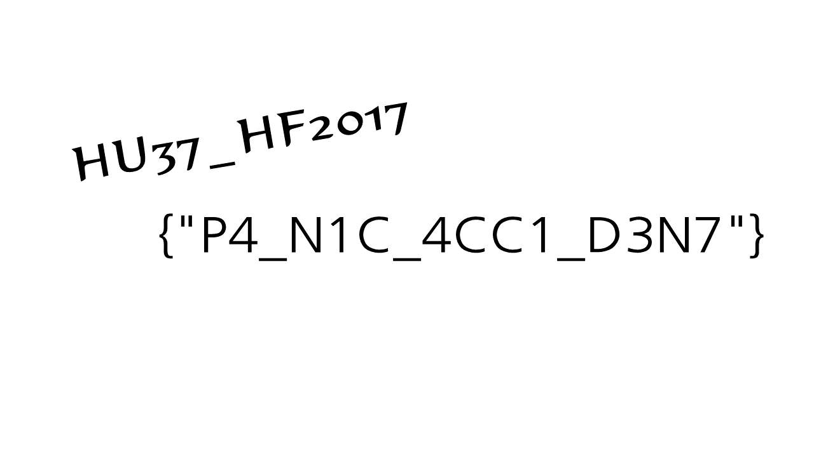

## No.18 Reversing Mystic_Crypt_9903[150]

**점수:** 150

**분야:** Reversing

**제목:** Mystic_Crypt_9903

**Description:**

> Find Flag.
> * It is Malware. Run only on virtual machines.
> 
> Download : https://goo.gl/ReYitl

주어진 랜섬웨어는 AES-256를 이용하여 파일을 암호화한다.

원본 파일을 16바이트씩 읽어서 암호화 한 후 파일에 쓸 때는 32바이트씩 쓴다.

따라서 다시 16바이트씩 건너가며 읽은 후 복호화하면 원본 파일을 구할 수 있다.

```python
from Crypto.Cipher import AES
 
enc = open('Find Me.hust', 'rb').read()
 
buffer = ''
for i in xrange(0, len(enc), 32):
    buffer += enc[i:i + 16]
 
key = 'I_L0V3_SeCuR1ty_VeRy_muCH_AndY0u'
aes = AES.new(key, AES.MODE_ECB)
dec = aes.decrypt(buffer)
 
open('Found.hust', 'wb').write(dec)
```


