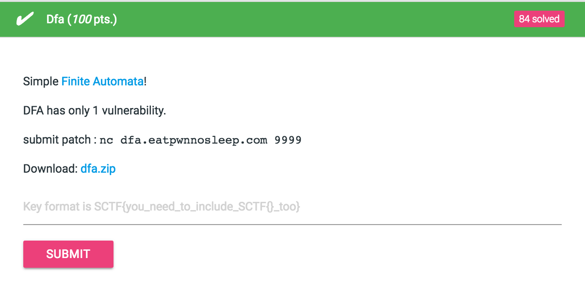

# Dfa (100 pts.)



### auto.c
```c
void add_node() {
    char linebuf[0x100];
    unsigned int namelen = 0;
    printf("length of name: ");
    fgets_eof(linebuf, 0x100);
    namelen = atoi(linebuf);
    if(namelen + 1 > 0x100){ //  ->  if(namelen > 0x99)
        puts("invalid length");
        return;
    }
    printf("name of node: ");
    namelen = read(0,linebuf,namelen);
    if(namelen > 1 && linebuf[namelen-1] == '\n')
        linebuf[namelen-1] = '\x00';
    else
        linebuf[namelen] = '\x00';
    if(find_DFA_by_name(linebuf)) {
        puts("name exists");
        return;
    }
    struct DFA_node* retval = (struct DFA_node*)malloc(sizeof(struct DFA_node));
    retval->is_final = 0;
    retval->rule = NULL;
    retval->name = strdup( linebuf );
    add_node_to_iter(retval);
    puts("add successful\n");
    return;
}
```

`if`문에서 `namelen`에 `int`값 들어갔는데

찝찝하게 `namelen + 1`해서 `0x100`보다 큰지 비교하길래 오버플로우 같은거 날것 같아서 `+1`을 빼줬다.

### Flag : SCTF{simple patch tutorial}.
