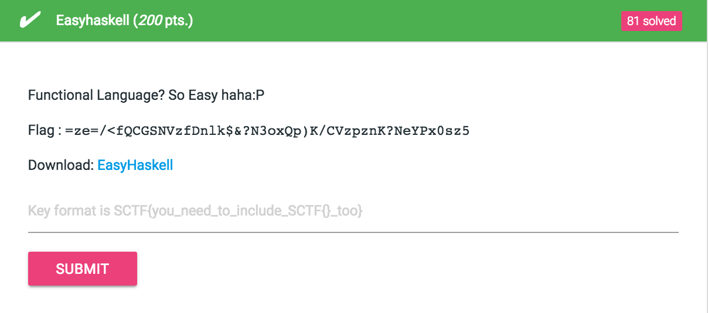

# Easyhaskell (200 pts.)




문제 파일을 분석하기전에 실행을 해봤는데 계속 같은 값이 나왔고 인자를 줘봤지만 동일했다.

결국 값이 출력되는 것은 파일 이름에 의해 바뀌는 것을 알게되었고 이것은 한글자씩 브루트포싱이 가능했다.

```python
import subprocess
import os

def system_call(command):
    p = subprocess.Popen([command], stdout=subprocess.PIPE, shell='/bin/bash/')
    return p.stdout.read()

table = 'ABCDEFGHIJKLMNOPQRSTUVWXYZ_abcdefghijklmnopqrstuvwxyz0123456789!=~?}'
answer = '=ze=/<fQCGSNVzfDnlk$&?N3oxQp)K/CVzpznK?NeYPx0sz5'
flag = 'SCTF{'
def brute(flag, idx):
	for ch in table:
		name = flag + ch
		os.rename('reset', name)
		d = eval(system_call('./' + name))
		os.rename(name, 'reset')

		if d == answer:
			print name
			exit()
		if d.find(answer[:idx + 1]) != -1:
			print name
			brute(name, idx + 2)
		elif d.find(answer[:idx]) != -1:
			print name
			brute(name, idx + 1)

brute(flag, 8)
```
### Flag : SCTF{D0_U_KNoW_fUnc10N4L_L4n9U4g3?}
