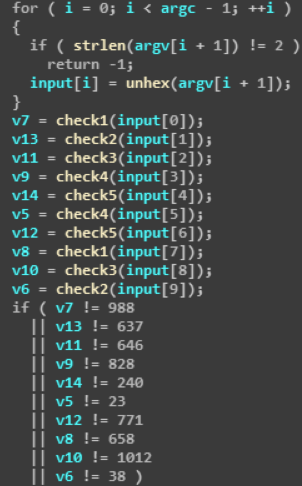
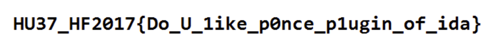

## No.13 Reversing shambles[300]

**점수:** 300

**분야:** Reversing

**제목:** shambles

**Description:**

> I have the FLAGKEY
> 
> Download : https://goo.gl/ZCI2QI



input 10바이트 검사 루틴을 크랙한다.

```c
#include <stdio.h>
 
int check1(char a1)
{
    int v2; // [esp+8h] [ebp+8h]@1
 
    v2 = 5 * (((a1 << 15) + ~a1) ^ (((a1 << 15) + ~a1) >> 12));
    return (2057 * (v2 ^ (v2 >> 4)) ^ (2057 * (v2 ^ (v2 >> 4)) >> 16)) % 1024;
}
 
int check2(char a1)
{
    int v1; // edx@1
    int v3; // [esp+8h] [ebp+8h]@1
    int v4; // [esp+8h] [ebp+8h]@1
 
    v3 = (a1 + ~(a1 << 31)) ^ ((a1 + ~(a1 << 31)) >> 22);
    v4 = 9 * ((v3 + ~(v3 << 13)) ^ ((v3 + ~(v3 << 13)) >> 8));
    v1 = (v4 ^ (v4 >> 15)) + ~((v4 ^ (v4 >> 15)) << 27);
    return (v1 ^ (v1 >> 31)) % 1024;
}
 
int check3(char a1)
{
    unsigned int v2; // [esp+8h] [ebp+8h]@1
    unsigned int v3; // [esp+8h] [ebp+8h]@1
 
    v2 = 9 * ((a1 + ~(a1 << 15)) ^ ((unsigned int)(a1 + ~(a1 << 15)) >> 10));
    v3 = (v2 ^ (v2 >> 6)) + ~((v2 ^ (v2 >> 6)) << 11);
    return (v3 ^ (v3 >> 16)) % 0x400;
}
 
int check4(char a1)
{
    unsigned int v2; // [esp+8h] [ebp+8h]@1
    unsigned int v3; // [esp+8h] [ebp+8h]@1
 
    v2 = 17 * (4097 * a1 ^ ((unsigned int)(4097 * a1) >> 22));
    v3 = 129 * (1025 * (v2 ^ (v2 >> 9)) ^ (1025 * (v2 ^ (v2 >> 9)) >> 2));
    return (v3 ^ (v3 >> 12)) % 0x400;
}
 
int check5(char a1)
{
    int v1; // edx@1
 
    v1 = 9 * ((a1 >> 16) ^ a1 ^ 0x3D) ^ (9 * ((a1 >> 16) ^ a1 ^ 0x3D) >> 4);
    return (668265261 * v1 ^ (668265261 * v1 >> 15)) % 1024;
}
 
int main()
{
    for (int x = 0; x < 256; ++x)
    {
        if (check2(x) == 38)
        {
            printf("%02x", (unsigned char)x);
        }
    }
 
    // 68 40 70 70 31 6e 33 73 73 21
    getc(stdin);
 
    return 0;
}
 ```
 
 argv[1]에 넣으면 %temp%에 답이 써진 png가 드롭된다


