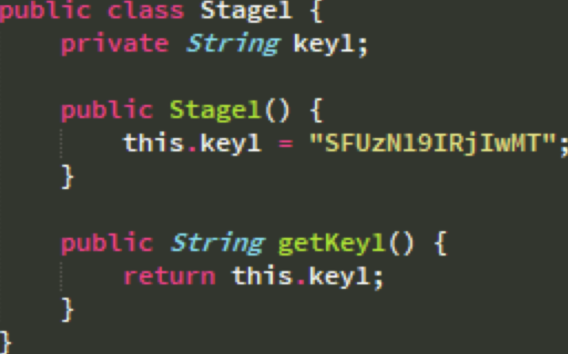
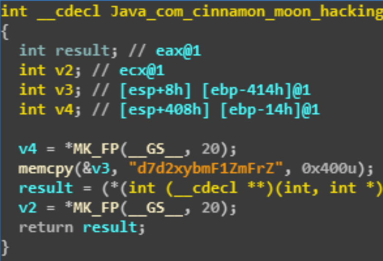
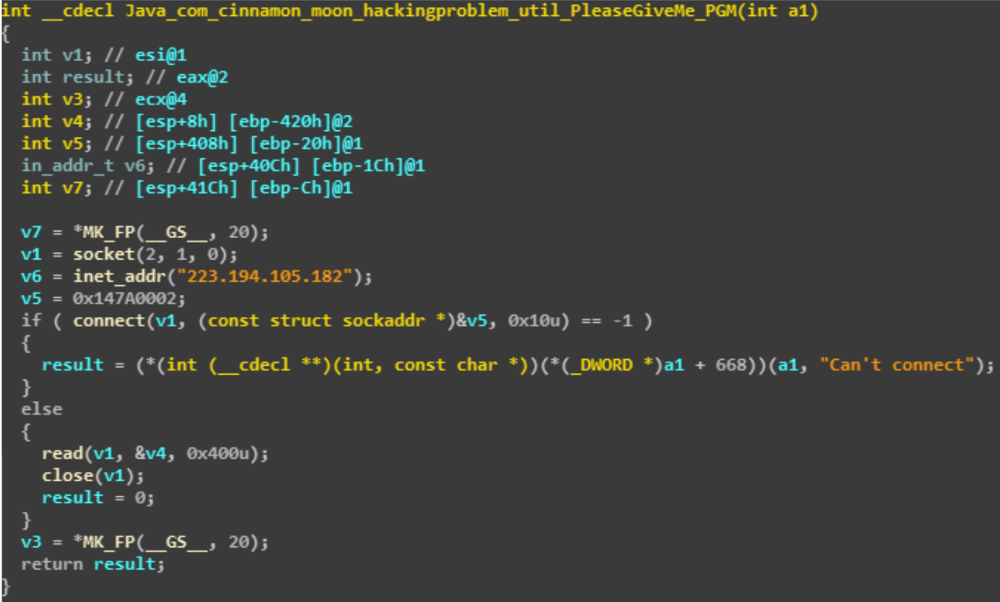

## No.8 Mobile STAGE-UP[100]

**점수:** 100

**분야:** Mobile

**제목:** STAGE-UP

**Description:**

> Go to last stage.
> 
> Download : https://goo.gl/n2Wg61

apk를 디컴파일해서 분석해보면 총 3개의 스테이지가 구성되어 있다. 

간단하게 스테이지1의 경우 util/Stage1.java에 키 값이 하드코딩되어 있다.

스테이지2부터는 JNI로 통신하여 키 값을 구해오는데 먼저 두번째 키는 libStage2.so 파일에서 구할 수 있다.

세번째 키는 libPGMT.so 파일에서 구할 수 있다.

재밌게 세번째 키 값은 서버에 접속해서 받아오는데 v5 변수를 잘 살펴보면 포트가 0x7a14 = 31252임을 알 수 있다. 서버에 접속하면 GRqc3dwZ2t3eX0= 라는 값을 보내준다.
 
3개의 키 값을 합쳐서 base64 decode하면 답을 구할 수 있다.
 
Flag: HU37_HF2017{wlrnaufakddjswpgkwy}
