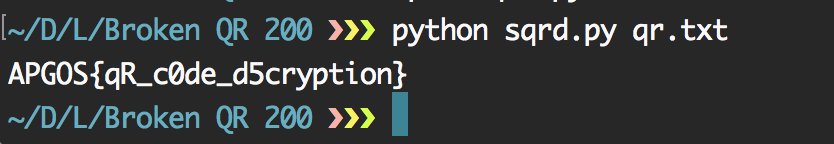

# League Of Hackers (ARGOS): Broken QR(200)

문제 파일:


손상된 QR코드다.

데이터가 저장되는 오른쪽 영역은 멀쩡하므로 일단 읽어보기로 했다.

strong qr decoder : [https://github.com/waidotto/strong-qr-decoder](https://github.com/waidotto/strong-qr-decoder)

일단 해당 디코더를 사용하려면 QR코드를 텍스트 파일로 변환해야 한다.

변환 :
```
?????????????__X__XXXXXXX
?????????????__XX_X_____X
?????????????_XXX_X_XXX_X
?????????????_XX__X_XXX_X
?????????????X_X__X_XXX_X
?????????????X_XX_X_____X
?????????????_X_X_XXXXXXX
?????????????XXXX____??_?
?????????????X___XX__?X_?
?????????????XX__XX____X?
?????????????_X_X_XX_X_X?
?????????????X_XX_X_X__X?
?????????????X__X_XXX_X_?
?????????????XX_X_X___X_?
????????????X_____X__X_X?
????????????XX__XX_X____?
????????????XX_XXXXXXXX_?
????????????____X___XX_X?
????????????__X_X_X_XX_XX
???????????XXXX_X___X____
???????????X_X__XXXXXX___
???????????_X________XX__
???????????_XX_XX__XXX__X
??????????__XXXXX______X_
??????????_XXX_XX_X_XX_XX
```

이제 읽어주면 답이 나온다.



APGOS라고 나오긴 했지만, ARGOS라고 수정해준 뒤 인증하면 된다.
