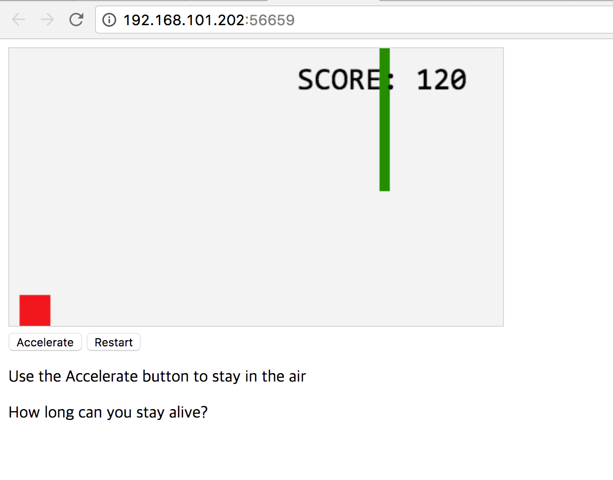
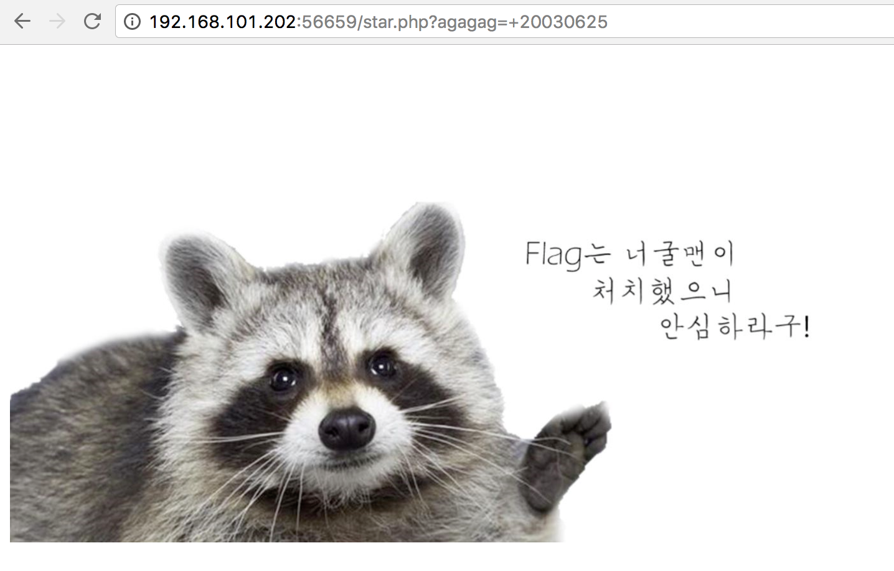
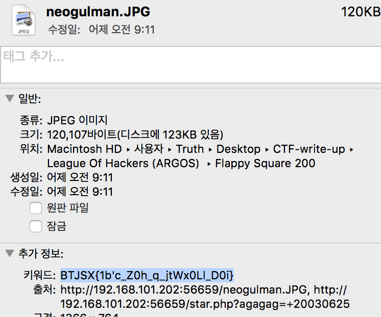

# League Of Hackers (ARGOS): Flappy Square(200)

문제 :



마치 Flappy Bird를 연상시키는 문제였다.

`javascript` 소스는 난독화가 되어있었다.

소스에서 `eval`하는 소스를 많이 찾을 수 있는데

```javascript
if (aggagg < 0) {
    agagag = (IIIIIIIIIi * 2) + '';
    agagag += iIIIIIIIII + '';
    agagag += (IIIIIIIIIi * 7) + '';
    agagag += IIIIIiIIII + '';
    agagag += IiIIIIIIII + '';
    agagag += IIiIIIIIII + '';
    aqaqaq = b1.substring(0, 2) + b5.substring(0, 2) + b9.substring(1, 3) + b13.substring(0, 2) + String.fromCharCode(0x2e) + b18.substring(5, 7);
    aqaqaq += b21.substring(0, 2) + String.fromCharCode(61) + String.fromCharCode(0x22) + String.fromCharCode(0x2e) + String.fromCharCode(47);
    aqaqaq += b25.substring(0, 4) + String.fromCharCode(0x2e) + b27.substring(3, 6) + String.fromCharCode(0x3f) + b26.substring(0, 6) + String.fromCharCode(61);
    aqaqaq += String.fromCharCode(0x22) + String.fromCharCode(0x2b) + agagag + String.fromCharCode(0x3b);
    eval(aqaqaq);
}
```

`aggagg`라는 변수는 처음부터 0이고 값이 변하는 순간이 없다.

또한 `eval`을 사용하는 저런 부분은 13개 이며 `aggagg`를 사용하는 부분은 12개다.

다른 하나는 `score`를 저장하고 있는 `ggqgggq`변수였다.

```javascript
if (ggqgggq < 0) {
    agagag = (IIIIIIIIIi * 20) + '';
    agagag += (IIIIIIIIIi * 3) + '';
    agagag += IIIIIiIIII + '';
    agagag += IiIIIIIIII + '';
    agagag += IIIIiIIIII + '';
    aqaqaq = b2.substring(2, 4) + b6.substring(1, 3) + b10.substring(1, 3) + b15.substring(1, 3) + String.fromCharCode(0x2e) + b19.substring(1, 3);
    aqaqaq += b22.substring(7, 9) + String.fromCharCode(61) + String.fromCharCode(0x22) + String.fromCharCode(0x2e) + String.fromCharCode(47);
    aqaqaq += b25.substring(4, 9) + String.fromCharCode(0x2e) + b27.substring(3, 6) + String.fromCharCode(0x3f) + b26.substring(0, 6);
    aqaqaq += String.fromCharCode(61) + String.fromCharCode(0x22) + String.fromCharCode(0x2b) + agagag + String.fromCharCode(0x3b);
    eval(aqaqaq);
}
```
`eval`하려는 내용은 `location.href="./star.php?agagag="+20030625;`

그대로 따라해보면 너굴맨이 반겨준다.



웹문제를 가장한 스테가노 문제라고 생각하여 이미지를 다운받았다.

스테가노 맞는가보다.



`BTJSX{1b'c_Z0h_q_jtWx0Ll_D0i}` 를 복호화 하면 된다.

```python
import string

def rot_n(n, s):
    lc = string.ascii_lowercase
    uc = string.ascii_uppercase
    trans = string.maketrans(lc + uc, lc[n:] + lc[:n] + uc[n:] + uc[:n])
    return string.translate(s, trans)

data = "BTJSX{1b'c_Z0h_q_jtWx0Ll_D0i}"
output = ''
for i in range(len(data)):
    output += rot_n(25 - i, data[i])
print output # ARGOS{1t's_N0t_a_raCc0On_D0g}
```
