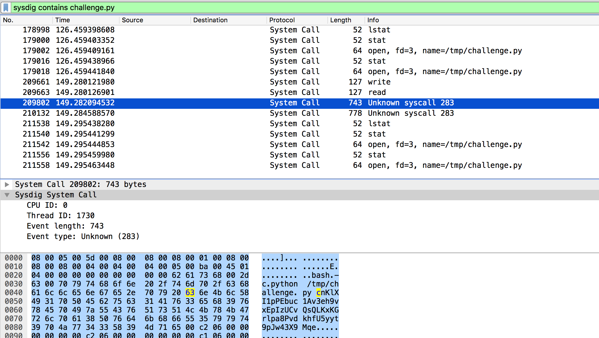
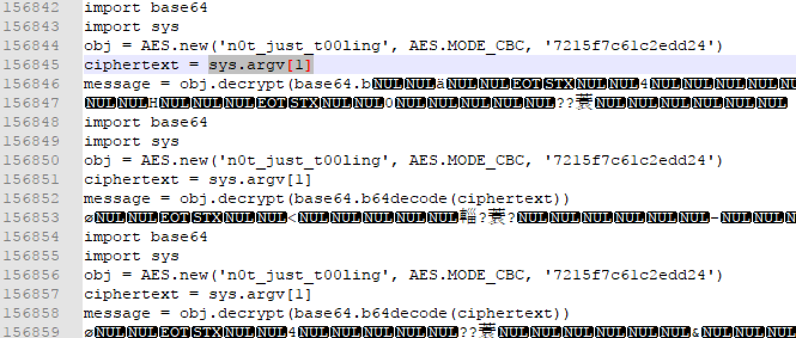
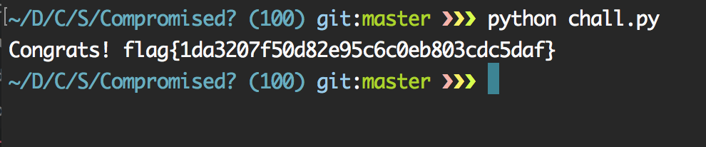

## Compromised? (100)

> We think our system got compromised, our hosting company uses some strange logtool. Are you able to dig into the logfile and find out if we are compromised?

> Challenge created by the Digital and Biometric Traces division of the Netherlands Forensic Institute.

 > [compromised.tgz](./compromised.tgz)  `42c948bf775a5bf0183ad54bbdc98123`


문제 풀이 의도가 `.scap`으로 확장자를 바꾸고 `sysdig`를 이용하는것이었지만 문제를 풀 당시에는 몰랐으므로 다른 삽질을 통해 푼 과정을 적겠다.

먼저 `FOR100.pcap`으로 이름을 바꾼뒤 `Wireshark`로 열면 `Systel Call` 프로토콜이 보인다.

`tshark`를 통해 `file`을 `open`하는 부분만 들고 와봤더니 많은 파일들중에서 `/tmp/challenge.py`가 눈에 띄었다.
> tshark -r FOR100.pcap -Y 'sysdig.event_type==3'

filter : `sysdig contains challenge.py`
`challenge.py`를 실행하는 인자가 `cnKlXI1pPEbuc1Av3eh9vxEpIzUCvQsQLKxKGrlpa8PvdkhfU5yyt9pJw43X9Mqe`라는걸 알 수 있었다.



`python code`를 이제 가져와봐야 되는데 인자를 넘기니까 `sys.argv[1]`을 검색하기로 했다.

소스를 찾았다.


`decrypt`를 진행해주면 `flag`가 나오게 된다.
```python
from Crypto.Cipher import AES
import base64
import sys

obj = AES.new('n0t_just_t00ling', AES.MODE_CBC, '7215f7c61c2edd24')
ciphertext = 'cnKlXI1pPEbuc1Av3eh9vxEpIzUCvQsQLKxKGrlpa8PvdkhfU5yyt9pJw43X9Mqe'
message = obj.decrypt(base64.b64decode(ciphertext))
print message
```


