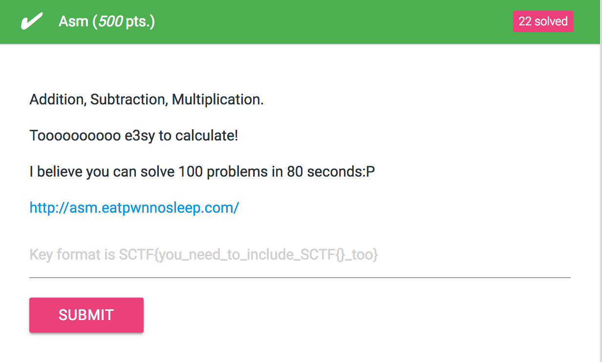
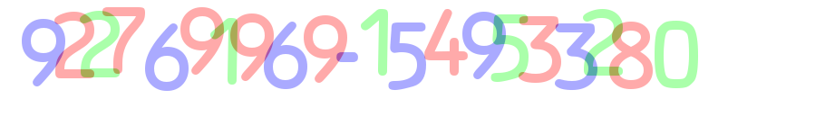
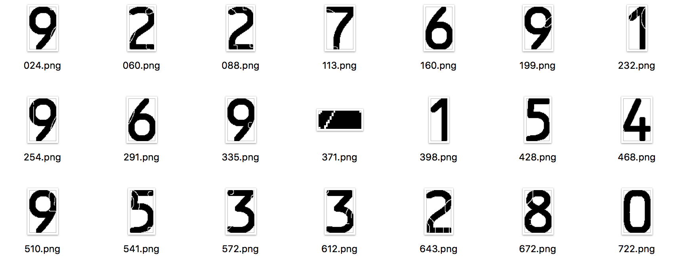
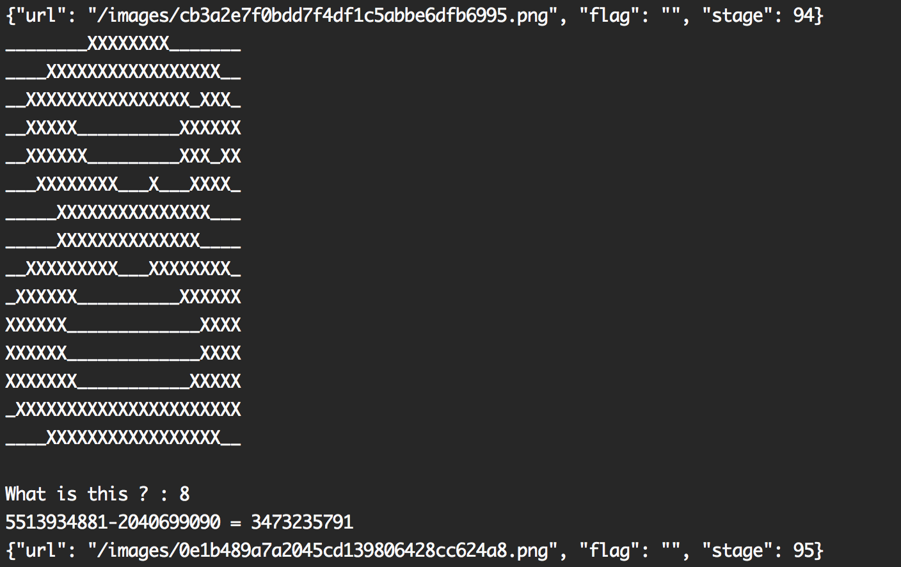

# Asm (500 pts.)



문제 요약



이미지를 보고 계산 결과를 보내주면 됐다.

또한, 100문제를 80초안에 해결해야 했으므로 자동화하는 것을 짜야했다.

### 문제 해결 과정
1. 먼저 색상을 기준으로 분리한다.

red.png

green.png

purple.png


2. red.png, green.png, purple.png에서 숫자를 하나하나 분리하는데 파일 이름을 x좌표로 한다.



3. 분리된 숫자들을 기반으로 각각의 기준이 되는 이미지를 정한다.

4. 기준이 되는 이미지와 width, height를 비교하여 무슨 숫자인지 판별 가능하다.

5. [0, 8, 6, 9], [3, 7]은 비슷하여 따로 비교하는 과정을 거친다.

6. 알고리즘이 불완전하기 때문에 무슨 숫자인지 모를경우 사람에게 직접 묻는 방법을 사용한다.




```python
import requests
import subprocess
import json
import sys
import urllib, cStringIO

from PIL import Image
from os import listdir, system
from os.path import isfile, join

black = (0, 0, 0, 255)
white = (255, 255, 255, 255)

green = (170, 255, 170, 255)
purple = (170, 170, 255, 255)
red = (255, 170, 170, 255)

red_purple = (170, 85, 170, 255)
green_purple = (85, 170, 170, 255)
red_green = (170, 170, 85, 255)

def is_purple(color):
	if color == white or color == green or color == red:
		return False
	if ((color[2] == 170 or color[2] == 255) and color[3] == 255):
		return True
	if color == red_purple or color == green_purple:
		return True
	return False

def is_red(color):
	if color == white or color == green or color == purple:
		return False
	if (color[0] == 170 or color[0] == 255) and color[3] == 255:
		return True
	if color == red_purple or color == red_green:
		return True
	return False

def is_green(color):
	if color == white or color == purple or color == red:
		return False
	if (color[1] == 170 or color[1] == 255) and color[3] == 255:
		return True
	if color == green_purple or color == red_green:
		return True
	return False

def extract_layer(func, name, output):
	img = Image.open(name)
	im = img.load()
	width, height = img.size
	for x in range(width):
		for y in range(height):
			if func(im[x, y]):
				im[x, y] = black
			else:
				im[x, y] = white
	img.save(output)

def y_fit(img):
	width, height = img.size
	im = img.load()

	sy = 0
	ey = 0

	count = 0
	for y in range(height):
		is_black = False
		for x in range(width):
			if im[x, y] != white:
				is_black = True

		if sy == 0 and is_black:
			sy = y
		if count > 0 and is_black:
			count -= 1
		if sy != 0 and not is_black:
			ey = y
			count += 1
		if sy != 0 and not is_black and count > 3:
			ey = y
			return sy, ey - count
	else:
		return sy, y - count

def x_slice(img):
	im = img.load()
	width, height = img.size
	sx = 0
	ex = 0
	count = 0

	arr = []
	for x in range(width):
		is_black = False
		for y in range(height):
			if im[x, y] != white:
				is_black = True

		if sx == 0 and is_black:
			sx = x
		if count > 0 and is_black:
			count -= 1
		if sx != 0 and not is_black and count < 3:
			count += 1
		if sx != 0 and not is_black and count >= 3:
			ex = x
			arr.append((sx, ex - count))
			count = 0
			sx = 0
	return arr

def extract_num(name):
	img = Image.open(name)
	width, height = img.size
	arr = x_slice(img)

	for i in range(len(arr)):
		a = img.crop((arr[i][0], 0, arr[i][1], height))
		sy, ey = y_fit(a)
		a = a.crop((0, sy, a.size[0], ey))
		if a.size[0] > 1 and a.size[1] > 1:
			a.save('extract/%03d.png' % arr[i][0])

def imgcmp4(img, img4, num):
	im4 = img4.load()
	im = img.load()
	count_0 = 0
	count_1 = 0

	width = min(img4.size[0], img.size[0])
	height = min(img4.size[1], img.size[1])

	for x in range(width):
		for y in range(height):
			if im[x, y] == im4[x, y]:
				count_0 += 1
			try:
				if im[x, y] == im4[x+1, y]:
					count_1 += 1
			except:
				pass

	if max([count_0, count_1]) > 3000:
		return '4'
	return num

def imgcmp37(img, im3, im7):
	count_3 = 0
	count_7 = 0

	width, height = img.size
	im = img.load()
	for x in range(width):
		for y in range(height):
			if im[x, y] == im3[x, y]:
				count_3 += 1
			if im[x, y] == im7[x, y]:
				count_7 += 1
	if count_3 > count_7:
		return '3'
	return '7'

def imgcmp0869(img, im0, im8, im6, im9):
	count_0 = 0
	count_8 = 0
	count_6 = 0
	count_9 = 0

	width, height = img.size

	im = img.load()
	for x in range(width):
		for y in range(height):
			if im[x, y] == im0[x, y]:
				count_0 += 1
			if im[x, y] == im8[x, y]:
				count_8 += 1
			if im[x, y] == im6[x, y]:
				count_6 += 1
			if im[x, y] == im9[x, y]:
				count_9 += 1

	arr = [count_0, count_8, count_6, count_9]
	if max(arr) == count_0:
		return '0'
	if max(arr) == count_8:
		return '8'
	if max(arr) == count_6:
		return '6'
	if max(arr) == count_9:
		return '9'

def img_to_str(url):
	system('rm -rf ./extract/*')

	image = cStringIO.StringIO(urllib.urlopen(url).read())

	img = Image.open(image)
	im = img.load()
	img.save('original.png')
	width, height = img.size

	extract_layer(is_purple, image, 'purple.png')
	extract_layer(is_red, image, 'red.png')
	extract_layer(is_green, image, 'green.png')

	extract_num('purple.png')
	extract_num('red.png')
	extract_num('green.png')

	path = './nums/'
	files = sorted([f for f in listdir(path) if isfile(join(path, f))])

	nums = {}
	for file in files:
		img = Image.open(path + file)
		name = file.split('.')[0]
		nums[img.size] = name

	path = './extract/'
	files = sorted([f for f in listdir(path) if isfile(join(path, f))])

	images = [Image.open('./nums/%d.png' % i) for i in range(10)]
	ims = [img.load() for img in images]
	result = ''
	for file in files:
		img = Image.open(path + file)
		try:
			num = nums[img.size].strip()

			num = imgcmp4(img, images[4], num)
			if num == '0' or num == '8' or num == '6' or num == '9':
				num = imgcmp0869(img, ims[0], ims[8], ims[6], ims[9])
			if num == '3' or num == '7':
				num = imgcmp37(img, ims[3], ims[7])
			result += num
		except:
			im = img.load()
			width, height = img.size

			output = ''
			for y in range(0, height, 5):
				for x in range(0, width, 2):
					if im[x, y] == white:
						output += '_'
					else:
						output += 'X'
				output += '\n'
			print output
			result += raw_input('What is this ? : ')

	return result

with requests.Session() as s:
	r = s.post('http://asm.eatpwnnosleep.com/start')
	url = r.text
	url = 'http://asm.eatpwnnosleep.com' + url
	print url

	while True:
		ans = img_to_str(url)
		print ans, '=',

		if ans.find('-') != -1:
			ans = int(ans.split('-')[0]) - int(ans.split('-')[1])
		elif ans.find('+') != -1:
			ans = int(ans.split('+')[0]) + int(ans.split('+')[1])
		elif ans.find('*') != -1:
			ans = int(ans.split('*')[0]) * int(ans.split('*')[1])

		print ans
		r = s.post('http://asm.eatpwnnosleep.com/check', data={'ans' : ans})
		print r.text

		url = json.loads(r.text)['url']
		url = 'http://asm.eatpwnnosleep.com' + url
```

### Flag : SCTF{Fun_with_0CR}
