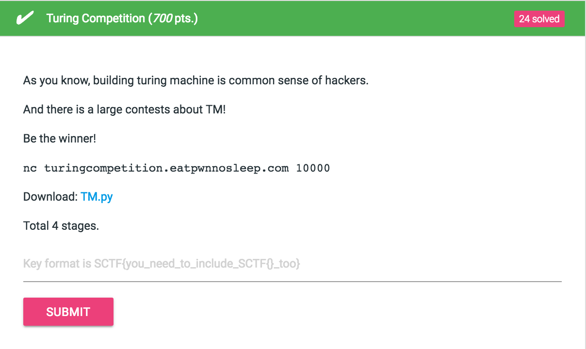

# Turing competition (700 pts.)



비공개된 tape에 대해서 문제에서 준 조건대로 검증을 하는 튜링머신을 짜는게 문제다.

[*] 풀이 코드가 가끔 안되기도 하지만 다시 시도해보면 test를 통과할 수 있다.

## Stage 1
```
==================== ['0' * n + '1' * m where (n>=0 and m>=0)] =====================
Warm up! '0' * n + '1' * m where (n>=0 and m>=0).
getInput>
```

### Solve
```
{
    "final_states": ["Accept", "Reject"],
    "initial_state": "A",
    "accepting_states": ["Accept"],
    "transition_function": [
        ["A", "0", "A", "0", "R"],
        ["A", "1", "B", "1", "R"],
        ["B", "1", "B", "1", "R"],
        ["B", " ", "Accept", " ", "R"],
        ["B", "0", "Reject", "0", "R"]
    ]
}
```
<table>
  <tr>
    <th>현재 상태
    <th>읽혀진 기호
    <th>쓰이는 기호
    <th>이동 종류
    <th>최종(다음) 상태
   <tr>
    <td> A
    <td> 0
    <td> 0
    <td> R
    <td> A
   <tr>
    <td> A
    <td> 1
    <td> 1
    <td> R
    <td> B
   <tr>
    <td> B
    <td> 1
    <td> 1
    <td> R
    <td> B
   <tr>
    <td> B
    <td>  
    <td>  
    <td> R
    <td> Accept
   <tr>
    <td> B
    <td> 0
    <td> 0
    <td> R
    <td> Reject
</table>

## Stage 2
```
==================== ['1'*x where (7 * x) % 13 == 1] =====================
something hard: '1'*x where (7 * x) % 13 == 1.
getInput>
```
먼저 `(7 * x) % 13 == 1` 라는 식에서 `x = 13n + 2 (n은 0이상의 정수)`라는 것을 이끌어낸다.

```
{
    "final_states": ["Accept", "Reject"],
    "initial_state": "A",
    "accepting_states": ["Accept"],
    "transition_function": [
        ["A", "1", "B", "1", "R"],
        ["A", " ", "Reject", " ", "R"],
        ["B", "1", "C", "1", "R"],
        ["B", " ", "Reject", " ", "R"],
        ["C", "1", "D", "1", "R"],
        ["C", " ", "Accept", " ", "R"],
        ["D", "1", "E", "1", "R"],
        ["D", " ", "Reject", " ", "R"],
        ["E", "1", "F", "1", "R"],
        ["E", " ", "Reject", " ", "R"],
        ["F", "1", "G", "1", "R"],
        ["F", " ", "Reject", " ", "R"],
        ["G", "1", "H", "1", "R"],
        ["G", " ", "Reject", " ", "R"],
        ["H", "1", "I", "1", "R"],
        ["H", " ", "Reject", " ", "R"],
        ["I", "1", "J", "1", "R"],
        ["I", " ", "Reject", " ", "R"],
        ["J", "1", "K", "1", "R"],
        ["J", " ", "Reject", " ", "R"],
        ["K", "1", "L", "1", "R"],
        ["K", " ", "Reject", " ", "R"],
        ["L", "1", "M", "1", "R"],
        ["L", " ", "Reject", " ", "R"],
        ["M", "1", "A", "1", "R"],
        ["M", " ", "Reject", " ", "R"]
    ]
}
```
<table>
  <tr>
    <th>현재 상태
    <th>읽혀진 기호
    <th>쓰이는 기호
    <th>이동 종류
    <th>최종(다음) 상태
   <tr>
    <td> A
    <td> 1
    <td> 1
    <td> R
    <td> B
   <tr>
    <td> A
    <td>  
    <td>  
    <td> R
    <td> Reject
   <tr>
    <td> B
    <td> 1
    <td> 1
    <td> R
    <td> C
   <tr>
    <td> B
    <td>  
    <td>  
    <td> R
    <td> Reject
   <tr>
    <td> C
    <td> 1
    <td> 1
    <td> R
    <td> D
   <tr>
    <td> C
    <td>  
    <td>  
    <td> R
    <td> Accpet
   <tr>
    <td> D
    <td> 1
    <td> 1
    <td> R
    <td> E
   <tr>
    <td> D
    <td>  
    <td>  
    <td> R
    <td> Reject
   <tr>
    <td> E
    <td> 1
    <td> 1
    <td> R
    <td> F
   <tr>
    <td> E
    <td>  
    <td>  
    <td> R
    <td> Reject
   <tr>
    <td> F
    <td> 1
    <td> 1
    <td> R
    <td> G
   <tr>
    <td> F
    <td>  
    <td>  
    <td> R
    <td> Reject
   <tr>
    <td> G
    <td> 1
    <td> 1
    <td> R
    <td> H
   <tr>
    <td> G
    <td>  
    <td>  
    <td> R
    <td> Reject
   <tr>
    <td> H
    <td> 1
    <td> 1
    <td> R
    <td> I
   <tr>
    <td> H
    <td>  
    <td>  
    <td> R
    <td> Reject
   <tr>
    <td> I
    <td> 1
    <td> 1
    <td> R
    <td> J
   <tr>
    <td> I
    <td>  
    <td>  
    <td> R
    <td> Reject
   <tr>
    <td> J
    <td> 1
    <td> 1
    <td> R
    <td> K
   <tr>
    <td> J
    <td>  
    <td>  
    <td> R
    <td> Reject
   <tr>
    <td> K
    <td> 1
    <td> 1
    <td> R
    <td> L
   <tr>
    <td> K
    <td>  
    <td>  
    <td> R
    <td> Reject
   <tr>
    <td> L
    <td> 1
    <td> 1
    <td> R
    <td> M
   <tr>
    <td> L
    <td>  
    <td>  
    <td> R
    <td> Reject
   <tr>
    <td> M
    <td> 1
    <td> 1
    <td> R
    <td> A
   <tr>
    <td> M
    <td>  
    <td>  
    <td> R
    <td> Reject
</table>

## Stage 3
```
==================== ['0'*n + '1'*n where (n>=0)] =====================
from regular to PDA: '0'*n + '1'*n where (n>=0).
getInput>
```

count한 0은 3으로 1은 2로 바꿔가며 세어나갈 수 있었다.

```
{
    "final_states": ["Accept", "Reject"],
    "initial_state": "A",
    "accepting_states": ["Accept"],
    "transition_function": [
        ["A", " ", "Accept", " ", "R"],
        ["A", "1", "Reject", "1", "R"],
        ["A", "0", "B", "3", "R"],
        ["A", "2", "D", "2", "R"],
        ["D", "1", "Reject", "1", "R"],
        ["D", "2", "D", "2", "R"],
        ["D", " ", "Accept", " ", "R"],
        ["B", "0", "B", "0", "R"],
        ["B", "2", "B", "2", "R"],
        ["B", " ", "Reject", " ", "R"],
        ["B", "1", "C", "2", "R"],
        ["C", "2", "C", "2", "L"],
        ["C", "0", "C", "0", "L"],
        ["C", "1", "C", "1", "L"],
        ["C", " ", "C", " ", "L"],
        ["C", "3", "A", "3", "R"]
    ]
}
```


<table>
  <tr>
    <th>현재 상태
    <th>읽혀진 기호
    <th>쓰이는 기호
    <th>이동 종류
    <th>최종(다음) 상태
   <tr>
    <td> A
    <td>  
    <td>  
    <td> R
    <td> Accept
   <tr>
    <td> A
    <td> 1
    <td> 1
    <td> R
    <td> Reject
   <tr>
    <td> A
    <td> 0
    <td> 3
    <td> R
    <td> B
   <tr>
    <td> A
    <td> 2
    <td> 2
    <td> R
    <td> D
   <tr>
    <td> B
    <td> 0
    <td> 0
    <td> R
    <td> B
   <tr>
    <td> B
    <td> 2
    <td> 2
    <td> R
    <td> B
   <tr>
    <td> B
    <td>  
    <td>  
    <td> R
    <td> Reject
   <tr>
    <td> B
    <td> 1
    <td> 2
    <td> R
    <td> C
   <tr>
    <td> C
    <td>  
    <td>  
    <td> L
    <td> C
   <tr>
    <td> C
    <td> 0
    <td> 0
    <td> L
    <td> C
   <tr>
    <td> C
    <td> 1
    <td> 1
    <td> L
    <td> C
   <tr>
    <td> C
    <td> 2
    <td> 2
    <td> L
    <td> C
   <tr>
    <td> C
    <td> 3
    <td> 3
    <td> R
    <td> A
   <tr>
    <td> D
    <td>  
    <td>  
    <td> R
    <td> Accept
   <tr>
    <td> D
    <td> 1
    <td> 1
    <td> R
    <td> Reject
   <tr>
    <td> D
    <td> 2
    <td> 2
    <td> R
    <td> D
</table>

## Stage 4

```
==================== ['0'*p where p is prime] =====================
Do you now prime?: '0'*p where p is prime.
getInput>
```

0의 갯수가 소수개 만큼인지 판별하는 문제다.

하드 코딩으로 소수인 상황일 때만 Accept가 되도록 짰다.

move제한만 있었지 조건 제한이 없었기 때문에 가능했다.

상태표는 생략한다.

```
{
    "final_states": ["Accept", "Reject"],
    "initial_state": "0",
    "accepting_states": ["Accept"],
    "transition_function": [
        ["0", " ", "Reject", " ", "R"],
        ["0", "0", "1", "0", "R"],
        ["1", " ", "Reject", " ", "R"],
        ["1", "0", "2", "0", "R"],
        ["2", " ", "Accept", " ", "R"],
        ["2", "0", "3", "0", "R"],
        ["3", " ", "Accept", " ", "R"],
        ["3", "0", "4", "0", "R"],
        ["4", " ", "Reject", " ", "R"],
        ["4", "0", "5", "0", "R"],
        ["5", " ", "Accept", " ", "R"],
        ["5", "0", "6", "0", "R"],
        ["6", " ", "Reject", " ", "R"],
        ["6", "0", "7", "0", "R"],
        ["7", " ", "Accept", " ", "R"],
        ["7", "0", "8", "0", "R"],
        ["8", " ", "Reject", " ", "R"],
        ["8", "0", "9", "0", "R"],
        ["9", " ", "Reject", " ", "R"],
        ["9", "0", "10", "0", "R"],
        ["10", " ", "Reject", " ", "R"],
        ["10", "0", "11", "0", "R"],
        ["11", " ", "Accept", " ", "R"],
        ["11", "0", "12", "0", "R"],
        ["12", " ", "Reject", " ", "R"],
        ["12", "0", "13", "0", "R"],
        ["13", " ", "Accept", " ", "R"],
        ["13", "0", "14", "0", "R"],
        ["14", " ", "Reject", " ", "R"],
        ["14", "0", "15", "0", "R"],
        ["15", " ", "Reject", " ", "R"],
        ["15", "0", "16", "0", "R"],
        ["16", " ", "Reject", " ", "R"],
        ["16", "0", "17", "0", "R"],
        ["17", " ", "Accept", " ", "R"],
        ["17", "0", "18", "0", "R"],
        ["18", " ", "Reject", " ", "R"],
        ["18", "0", "19", "0", "R"],
        ["19", " ", "Accept", " ", "R"],
        ["19", "0", "20", "0", "R"],
        ["20", " ", "Reject", " ", "R"],
        ["20", "0", "21", "0", "R"],
        ["21", " ", "Reject", " ", "R"],
        ["21", "0", "22", "0", "R"],
        ["22", " ", "Reject", " ", "R"],
        ["22", "0", "23", "0", "R"],
        ["23", " ", "Accept", " ", "R"],
        ["23", "0", "24", "0", "R"],
        ["24", " ", "Reject", " ", "R"],
        ["24", "0", "25", "0", "R"],
        ["25", " ", "Reject", " ", "R"],
        ["25", "0", "26", "0", "R"],
        ["26", " ", "Reject", " ", "R"],
        ["26", "0", "27", "0", "R"],
        ["27", " ", "Reject", " ", "R"],
        ["27", "0", "28", "0", "R"],
        ["28", " ", "Reject", " ", "R"],
        ["28", "0", "29", "0", "R"],
        ["29", " ", "Accept", " ", "R"],
        ["29", "0", "30", "0", "R"],
        ["30", " ", "Reject", " ", "R"],
        ["30", "0", "31", "0", "R"],
        ["31", " ", "Accept", " ", "R"],
        ["31", "0", "32", "0", "R"],
        ["32", " ", "Reject", " ", "R"],
        ["32", "0", "33", "0", "R"],
        ["33", " ", "Reject", " ", "R"],
        ["33", "0", "34", "0", "R"],
        ["34", " ", "Reject", " ", "R"],
        ["34", "0", "35", "0", "R"],
        ["35", " ", "Reject", " ", "R"],
        ["35", "0", "36", "0", "R"],
        ["36", " ", "Reject", " ", "R"],
        ["36", "0", "37", "0", "R"],
        ["37", " ", "Accept", " ", "R"],
        ["37", "0", "38", "0", "R"],
        ["38", " ", "Reject", " ", "R"],
        ["38", "0", "39", "0", "R"],
        ["39", " ", "Reject", " ", "R"],
        ["39", "0", "40", "0", "R"],
        ["40", " ", "Reject", " ", "R"],
        ["40", "0", "41", "0", "R"],
        ["41", " ", "Accept", " ", "R"],
        ["41", "0", "42", "0", "R"],
        ["42", " ", "Reject", " ", "R"],
        ["42", "0", "43", "0", "R"],
        ["43", " ", "Accept", " ", "R"],
        ["43", "0", "44", "0", "R"],
        ["44", " ", "Reject", " ", "R"],
        ["44", "0", "45", "0", "R"],
        ["45", " ", "Reject", " ", "R"],
        ["45", "0", "46", "0", "R"],
        ["46", " ", "Reject", " ", "R"],
        ["46", "0", "47", "0", "R"],
        ["47", " ", "Accept", " ", "R"],
        ["47", "0", "48", "0", "R"],
        ["48", " ", "Reject", " ", "R"],
        ["48", "0", "49", "0", "R"],
        ["49", " ", "Reject", " ", "R"],
        ["49", "0", "50", "0", "R"],
        ["50", " ", "Reject", " ", "R"],
        ["50", "0", "51", "0", "R"],
        ["51", " ", "Reject", " ", "R"],
        ["51", "0", "52", "0", "R"],
        ["52", " ", "Reject", " ", "R"],
        ["52", "0", "53", "0", "R"],
        ["53", " ", "Accept", " ", "R"],
        ["53", "0", "54", "0", "R"],
        ["54", " ", "Reject", " ", "R"],
        ["54", "0", "55", "0", "R"],
        ["55", " ", "Reject", " ", "R"],
        ["55", "0", "56", "0", "R"],
        ["56", " ", "Reject", " ", "R"],
        ["56", "0", "57", "0", "R"],
        ["57", " ", "Reject", " ", "R"],
        ["57", "0", "58", "0", "R"],
        ["58", " ", "Reject", " ", "R"],
        ["58", "0", "59", "0", "R"],
        ["59", " ", "Accept", " ", "R"],
        ["59", "0", "60", "0", "R"],
        ["60", " ", "Reject", " ", "R"],
        ["60", "0", "61", "0", "R"],
        ["61", " ", "Accept", " ", "R"],
        ["61", "0", "62", "0", "R"],
        ["62", " ", "Reject", " ", "R"],
        ["62", "0", "63", "0", "R"],
        ["63", " ", "Reject", " ", "R"],
        ["63", "0", "64", "0", "R"],
        ["64", " ", "Reject", " ", "R"],
        ["64", "0", "65", "0", "R"],
        ["65", " ", "Reject", " ", "R"],
        ["65", "0", "66", "0", "R"],
        ["66", " ", "Reject", " ", "R"],
        ["66", "0", "67", "0", "R"],
        ["67", " ", "Accept", " ", "R"],
        ["67", "0", "68", "0", "R"],
        ["68", " ", "Reject", " ", "R"],
        ["68", "0", "69", "0", "R"],
        ["69", " ", "Reject", " ", "R"],
        ["69", "0", "70", "0", "R"],
        ["70", " ", "Reject", " ", "R"],
        ["70", "0", "71", "0", "R"],
        ["71", " ", "Accept", " ", "R"],
        ["71", "0", "72", "0", "R"],
        ["72", " ", "Reject", " ", "R"],
        ["72", "0", "73", "0", "R"],
        ["73", " ", "Accept", " ", "R"],
        ["73", "0", "74", "0", "R"],
        ["74", " ", "Reject", " ", "R"],
        ["74", "0", "75", "0", "R"],
        ["75", " ", "Reject", " ", "R"],
        ["75", "0", "76", "0", "R"],
        ["76", " ", "Reject", " ", "R"],
        ["76", "0", "77", "0", "R"],
        ["77", " ", "Reject", " ", "R"],
        ["77", "0", "78", "0", "R"],
        ["78", " ", "Reject", " ", "R"],
        ["78", "0", "79", "0", "R"],
        ["79", " ", "Accept", " ", "R"],
        ["79", "0", "80", "0", "R"],
        ["80", " ", "Reject", " ", "R"],
        ["80", "0", "81", "0", "R"],
        ["81", " ", "Reject", " ", "R"],
        ["81", "0", "82", "0", "R"],
        ["82", " ", "Reject", " ", "R"],
        ["82", "0", "83", "0", "R"],
        ["83", " ", "Accept", " ", "R"],
        ["83", "0", "84", "0", "R"],
        ["84", " ", "Reject", " ", "R"],
        ["84", "0", "85", "0", "R"],
        ["85", " ", "Reject", " ", "R"],
        ["85", "0", "86", "0", "R"],
        ["86", " ", "Reject", " ", "R"],
        ["86", "0", "87", "0", "R"],
        ["87", " ", "Reject", " ", "R"],
        ["87", "0", "88", "0", "R"],
        ["88", " ", "Reject", " ", "R"],
        ["88", "0", "89", "0", "R"],
        ["89", " ", "Accept", " ", "R"],
        ["89", "0", "90", "0", "R"],
        ["90", " ", "Reject", " ", "R"],
        ["90", "0", "91", "0", "R"],
        ["91", " ", "Reject", " ", "R"],
        ["91", "0", "92", "0", "R"],
        ["92", " ", "Reject", " ", "R"],
        ["92", "0", "93", "0", "R"],
        ["93", " ", "Reject", " ", "R"],
        ["93", "0", "94", "0", "R"],
        ["94", " ", "Reject", " ", "R"],
        ["94", "0", "95", "0", "R"],
        ["95", " ", "Reject", " ", "R"],
        ["95", "0", "96", "0", "R"],
        ["96", " ", "Reject", " ", "R"],
        ["96", "0", "97", "0", "R"],
        ["97", " ", "Accept", " ", "R"],
        ["97", "0", "98", "0", "R"],
        ["98", " ", "Reject", " ", "R"],
        ["98", "0", "99", "0", "R"],
        ["99", " ", "Reject", " ", "R"],
        ["99", "0", "100", "0", "R"]
    ]
}
```

### Flag : SCTF{Turing_Machine_is_v3ry_p0werful1}
